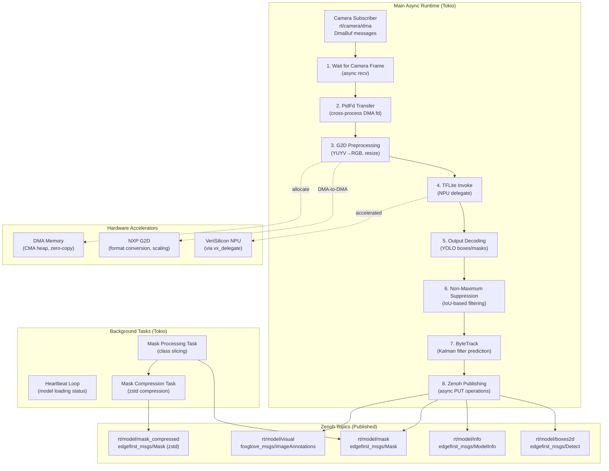
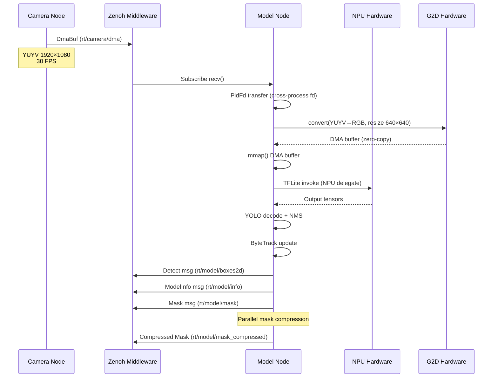
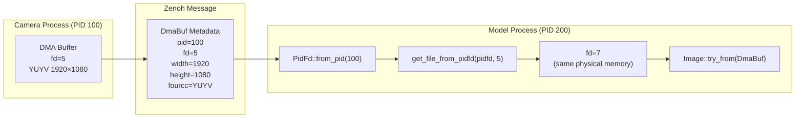
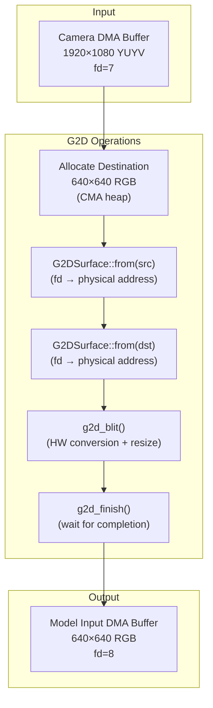
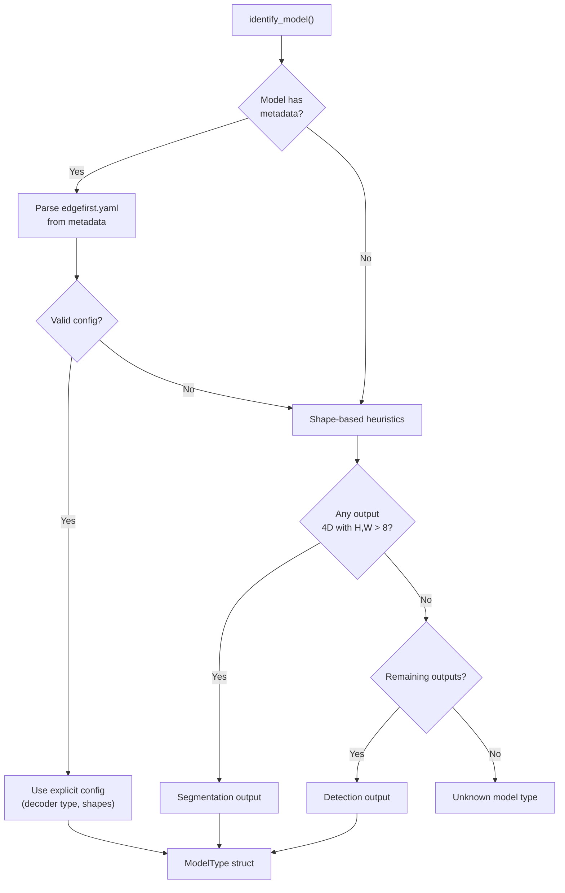
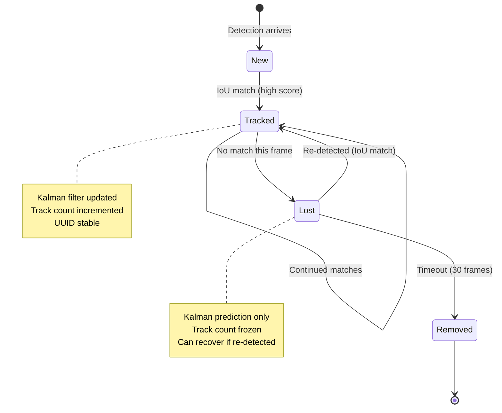

# EdgeFirst Model Node - Architecture

**Technical architecture documentation for developers**

This document describes the internal architecture of the EdgeFirst Model Node, focusing on the async runtime model, data flow patterns, hardware integration, and system design decisions. For user-facing documentation, see [README.md](README.md).

---

## Table of Contents

1. [System Overview](#system-overview)
2. [Module Architecture](#module-architecture)
3. [Data Flow](#data-flow)
4. [Message Formats](#message-formats)
5. [Hardware Integration](#hardware-integration)
6. [Model Identification and Decoding](#model-identification-and-decoding)
7. [Object Tracking](#object-tracking)
8. [Instrumentation and Profiling](#instrumentation-and-profiling)
9. [References](#references)

---

## System Overview

The EdgeFirst Model Node is an asynchronous application built on the Tokio async runtime. It implements a **publish-subscribe pattern** where the main async loop subscribes to camera DMA buffers, performs hardware-accelerated AI inference, and publishes detection results via Zenoh.

### Architecture Diagram



### Key Architectural Properties

- **Async Main Loop**: Single-threaded async runtime for I/O-bound operations (Zenoh subscribe/publish)
- **Zero-Copy DMA**: Camera buffers transferred via PidFd; only metadata crosses process boundaries
- **Hardware Acceleration**: G2D for image preprocessing, NPU for inference (with CPU fallback)
- **Parallel Mask Processing**: Segmentation mask handling runs on separate Tokio tasks for non-blocking pipeline
- **ByteTrack Integration**: Multi-object tracking with Kalman filter prediction (constant velocity model)
- **Runtime Dynamic Loading**: Both G2D and TFLite loaded via `libloading` (dlopen) for platform portability
- **Model Agnostic**: Supports TFLite (.tflite) and VAAL RTM (.rtm) models with auto-detection of output formats

---

## Module Architecture

### Main Application (`main.rs`)

**Responsibilities:**

- Tokio async runtime initialization
- Tracing subscriber setup (stdout, journald, Tracy)
- Zenoh session and topic management
- Camera frame subscription loop
- Model loading and inference orchestration
- Result publishing coordination

**Execution Model:**

The application uses a `#[tokio::main]` async runtime and executes the following workflow:

1. **Initialization:**
   - Parse CLI arguments (Clap)
   - Start Tracy profiler (optional)
   - Configure tracing layers (stdout, journald, Tracy)
   - Open Zenoh session

2. **Heartbeat Phase:**
   - Subscribe to camera info topic (determine stream resolution)
   - Spawn heartbeat task (publishes empty detections while model loads)
   - Load model file (TFLite or RTM)
   - Initialize NPU delegate or CPU fallback
   - Identify model type (detection, segmentation, instance segmentation)

3. **Main Inference Loop:**
   ```rust
   loop {
       // Async receive camera DMA buffer
       let dma_buf = wait_for_camera_frame(&sub_camera, timeout);

       // G2D preprocessing (YUYV→RGB, resize)
       model.load_frame_dmabuf(&dma_buf, &img_mgr, Preprocessing::Raw);

       // TFLite invoke (NPU or CPU)
       model.run_model();

       // Decode outputs (YOLO, ModelPack)
       model.decode_outputs(&mut boxes, &mut protos);

       // ByteTrack update (if tracking enabled)
       tracker.update(&boxes, timestamp);

       // Async publish results
       publ_detect.put(detect_msg).await;
       publ_model_info.put(info_msg).await;

       // Tracy frame marker
       frame_mark();
   }
   ```

---

### Core Library (`lib.rs`)

**Public API:**

- `identify_model()` - Auto-detect model type from output shapes or metadata
- `run_detection()` - Coordinate decoding, NMS, and tracking
- `wait_for_camera_frame()` - Async camera frame receive with timeout
- `heart_beat()` - Background task for model loading status
- `BoxWithTrack` - Detection box with tracking metadata
- `ModelType` - Model capability descriptor (detection, segmentation, instance segmentation)

**Model Identification Strategy:**

The node supports two identification methods:

1. **Metadata-Based** (preferred): Read `edgefirst.yaml` from model metadata
   - Explicit output configuration with decoder types
   - Shape validation against actual model outputs
   - Supports YOLO v5/v8/v10/v11 and ModelPack decoders

2. **Shape-Based** (fallback): Heuristic analysis of output tensor shapes
   - Segmentation: 4D tensor with spatial dimensions > 8×8
   - Detection: Remaining outputs assumed to be bounding boxes
   - Less reliable but works with unconfigured models

---

### Image Management (`image.rs`)

**Purpose:** Hardware-accelerated image preprocessing using NXP G2D

**Core Types:**

- `Image` - DMA-backed image with file descriptor, dimensions, and FourCC format
- `ImageManager` - G2D device wrapper (runtime dlopen of `libg2d.so.2`)
- `MappedImage` - Memory-mapped view of DMA buffer for CPU access
- `Rect` - Cropping rectangle specification
- `Rotation` - 0°/90°/180°/270° rotation enumeration

**G2D Operations:**

The `ImageManager::convert()` method performs hardware-accelerated blitting:

```rust
pub fn convert(
    &self,
    from: &Image,        // Source DMA buffer
    to: &Image,          // Destination DMA buffer
    crop: Option<Rect>,  // Optional cropping region
    rot: Rotation,       // Rotation transformation
) -> Result<(), Box<dyn Error>>
```

**Supported Conversions:**

- **Format Conversion:** YUYV → RGB, RGBX, NV12
- **Scaling:** Arbitrary resolution changes (e.g., 1920×1080 → 640×640)
- **Cropping:** Extract rectangular regions for tiling
- **Rotation:** 90° increments with format preservation

**Memory Management:**

Images are allocated from the **CMA (Contiguous Memory Allocator) heap** via `dma-heap` crate:
- Zero-copy sharing between processes via PidFd
- G2D operates directly on DMA physical addresses
- `MappedImage` provides temporary CPU access when needed (e.g., feeding NPU)

---

### Model Abstraction (`model.rs`)

**Design:** `enum_dispatch` pattern for runtime polymorphism without vtable overhead

**Core Trait:**

```rust
#[enum_dispatch(Model)]
pub trait Model {
    fn input_count(&self) -> Result<usize, ModelError>;
    fn output_count(&self) -> Result<usize, ModelError>;
    fn input_shape(&self, index: usize) -> Result<Vec<usize>, ModelError>;
    fn output_shape(&self, index: usize) -> Result<Vec<usize>, ModelError>;
    fn run_model(&mut self) -> Result<(), ModelError>;
    fn decode_outputs(
        &self,
        boxes: &mut Vec<DetectBox>,
        protos: &mut Option<Array3<f32>>,
    ) -> Result<(), ModelError>;
    fn load_frame_dmabuf(
        &mut self,
        dma_buf: &DmaBuf,
        img_mgr: &ImageManager,
        preprocessing: Preprocessing,
    ) -> Result<(), ModelError>;
    fn labels(&self) -> Result<Vec<String>, ModelError>;
    fn get_model_metadata(&self) -> Result<Metadata, ModelError>;
}
```

**Supported Implementations:**

- `TFLiteModel` - TensorFlow Lite models with NPU delegate
- `RtmModel` - VAAL RTM models (feature-gated behind `rtm` feature)

**Detection Box Type:**

```rust
pub struct DetectBox {
    pub xmin: f32,           // Normalized [0.0, 1.0]
    pub ymin: f32,
    pub xmax: f32,
    pub ymax: f32,
    pub score: f32,          // Confidence score
    pub label: usize,        // Class index
    pub mask_coeff: Option<Array1<f32>>,  // Instance segmentation coefficients
}
```

**YOLO Decoder Support:**

The model module includes decoders for multiple YOLO variants:
- **YOLOv5/v8**: Bounding boxes + class scores (with optional instance segmentation)
- **YOLOv10**: Bounding boxes + class scores (end-to-end, no NMS needed)
- **YOLOv11**: Latest YOLO architecture
- **ModelPack**: Au-Zone's proprietary format (separate boxes/scores tensors)

**Preprocessing Modes:**

```rust
pub enum Preprocessing {
    Raw,            // No normalization (uint8 → uint8)
    UnsignedNorm,   // [0, 255] → [0.0, 1.0]
    SignedNorm,     // [0, 255] → [-1.0, 1.0]
    ImageNet,       // ImageNet mean/std normalization
}
```

---

### TFLite Model (`tflite_model.rs`)

**Purpose:** TensorFlow Lite runtime integration with NPU delegate support

**Runtime Loading:**

The `TFLiteLib` struct uses `libloading` to dynamically load `libtensorflowlite_c.so`:
- **Why dlopen?** Allows builds to succeed on platforms without TFLite installed
- **NPU Delegate:** `libvx_delegate.so` (VeriSilicon NPU acceleration)
- **CPU Fallback:** Built-in XNNPACK delegate if NPU unavailable

**Model Loading Workflow:**

```rust
let tflite = TFLiteLib::new()?;  // dlopen libtensorflowlite_c.so
let model_data = std::fs::read("model.tflite")?;
let delegate = Some("libvx_delegate.so");  // NPU acceleration
let model = tflite.load_model_from_mem_with_delegate(model_data, delegate)?;
```

**Tensor I/O:**

- **Input Feeding:** Copy from mapped DMA buffer to TFLite input tensor
- **Output Reading:** Zero-copy view of TFLite output tensors (when possible)
- **Quantization:** Auto-dequantization for uint8/int8 quantized models

**Metadata Extraction:**

The TFLite model can embed metadata in FlatBuffers format:
- Model name, version, description, author, license
- `edgefirst.yaml` configuration (output decoders, shapes, preprocessing)
- Label strings for class names

---

### Object Tracking (`tracker.rs`, `kalman.rs`)

**Algorithm:** ByteTrack multi-object tracking with Kalman filter prediction

**Core Types:**

```rust
pub struct ByteTrack {
    pub tracklets: Vec<Tracklet>,       // Active tracks
    pub lost_tracks: Vec<Tracklet>,     // Recently lost (recovery period)
    pub removed_tracks: Vec<Tracklet>,  // Permanently removed
    pub frame_count: i32,
}

pub struct Tracklet {
    pub id: Uuid,                        // Unique track identifier
    pub prev_boxes: DetectBox,           // Last detection
    pub filter: ConstantVelocityXYAHModel2<f32>,  // Kalman filter
    pub count: i32,                      // Number of updates
    pub created: u64,                    // Creation timestamp
    pub last_updated: u64,               // Last update timestamp
}
```

**Kalman Filter State:**

The tracker uses a **constant velocity model** with XYAH (center x, center y, aspect ratio, height) representation:

- **State Vector:** `[x, y, a, h, vx, vy, va, vh]` (position + velocity)
- **Process Noise:** Accounts for acceleration uncertainty
- **Measurement:** Bounding box observations in XYAH coordinates

**Tracking Workflow:**

1. **Prediction:** Kalman filter predicts next positions for existing tracklets
2. **Assignment:** Hungarian algorithm (LAPJV) matches detections to predictions via IoU
3. **Update:** Matched tracklets update Kalman state with new observations
4. **Initialization:** Unmatched detections create new tracklets
5. **Termination:** Unmatched tracklets move to lost_tracks, then removed after timeout

**Association Metrics:**

- **High Score:** IoU matching for high-confidence detections
- **Low Score:** IoU matching for low-confidence detections (second pass)
- **Threshold:** Configurable via `--track-iou-threshold` (default: 0.5)

---

### Non-Maximum Suppression (`nms.rs`)

**Purpose:** Remove duplicate detections with overlapping bounding boxes

**Algorithm:** Greedy IoU-based suppression

```rust
pub fn nms(boxes: &mut Vec<DetectBox>, iou_threshold: f32) -> Vec<DetectBox>
```

**Workflow:**

1. Sort boxes by confidence score (descending)
2. Select highest-scoring box, add to output
3. Remove all boxes with IoU > threshold relative to selected box
4. Repeat until no boxes remain

**Optimization:**

The `decode_boxes_and_nms()` function combines YOLO decoding with NMS for efficiency:
- Early filtering of low-confidence boxes (before NMS)
- Parallel decoding using `ndarray`'s rayon integration
- Single allocation for output boxes

---

### Mask Processing (`masks.rs`)

**Purpose:** Asynchronous segmentation mask handling and publishing

**Background Tasks:**

The main loop spawns two Tokio tasks for mask processing:

1. **`mask_thread()`** - Mask slicing and publishing
   - Receives full segmentation masks via mpsc channel
   - Optionally slices to specific classes (`--mask-classes`)
   - Publishes to `rt/model/mask` (uncompressed CDR)
   - Forwards to compression task if enabled

2. **`mask_compress_thread()`** - Zstd compression
   - Receives masks from mask_thread
   - Compresses using zstd (`--mask-compression-level`)
   - Publishes to `rt/model/mask_compressed`
   - Typical compression ratio: 10-30% of original size

**Non-Blocking Design:**

Mask processing runs in parallel with the main inference loop:
- Main loop continues to next frame while masks are processing
- Bounded channels (size 50) provide backpressure if mask tasks fall behind
- `drain_recv()` helper ensures latest mask is processed if backlog occurs

---

## Data Flow

### End-to-End Pipeline



### Zero-Copy DMA Transfer

The EdgeFirst ecosystem uses **PidFd-based file descriptor passing** for zero-copy DMA sharing:



**Key Points:**

- Only metadata (file descriptor number, dimensions, format) is serialized
- Physical memory is never copied between processes
- Kernel handles translation: `PidFd + remote_fd → local_fd`
- Requires same permissions for both processes (both root or same user)

---

### G2D Preprocessing Flow



**Performance:**

G2D hardware acceleration provides significant speedup over CPU-based conversion:
- 1920×1080 YUYV → 640×640 RGB: ~2-5ms (vs ~15-30ms CPU)
- DMA-to-DMA operation (no CPU memory bandwidth consumption)
- Parallel execution with NPU inference preparation

---

## Message Formats

All messages use **ROS2 CDR (Common Data Representation)** serialization for ecosystem compatibility.

### DmaBuf Message (Subscribed)

```rust
// edgefirst_msgs/DmaBuf
pub struct DmaBuf {
    pub header: Header,           // ROS2 standard header (timestamp, frame_id)
    pub fd: u32,                  // Source process file descriptor
    pub offset: u64,              // Offset into DMA buffer
    pub stride: u32,              // Row stride (bytes per line)
    pub width: u32,               // Image width
    pub height: u32,              // Image height
    pub size: u64,                // Total buffer size
    pub fourcc: u32,              // Pixel format (YUYV, NV12, etc.)
    pub pid: u32,                 // Source process ID (for PidFd transfer)
}
```

**Consumer Workflow:**

1. Deserialize `DmaBuf` from Zenoh payload
2. Create `PidFd` from `dma_buf.pid`
3. Call `get_file_from_pidfd(pidfd, dma_buf.fd)` to obtain local file descriptor
4. Create `Image` wrapper with local fd + metadata
5. Pass to G2D for preprocessing

---

### Detect Message (Published)

```rust
// edgefirst_msgs/Detect
pub struct Detect {
    pub header: Header,
    pub boxes: Vec<DetectBox2D>,
    pub model_time: Time,         // Inference duration
    pub stamp: Time,              // Total processing time
}

pub struct DetectBox2D {
    pub xmin: f64,                // Normalized [0.0, 1.0]
    pub ymin: f64,
    pub xmax: f64,
    pub ymax: f64,
    pub score: f64,
    pub label: String,            // "person", "car", etc.
    pub index: i32,               // Class index
    pub uuid: String,             // Track UUID (if tracking enabled)
    pub track_count: i32,         // Track age (if tracking enabled)
    pub track_created: u64,       // Track creation time (if tracking enabled)
    pub track_updated: u64,       // Track update time (if tracking enabled)
}
```

**Published Rate:** Same as camera FPS (typically 30 Hz)

---

### ModelInfo Message (Published)

```rust
// edgefirst_msgs/ModelInfo
pub struct ModelInfo {
    pub header: Header,
    pub model_path: String,       // Path to model file
    pub model_name: String,       // Model filename
    pub model_type: String,       // "detection", "segmentation", etc.
    pub labels: Vec<String>,      // Class names
    pub input_shape: Vec<u32>,    // Model input dimensions
    pub detection: bool,          // Has detection output
    pub segmentation: bool,       // Has segmentation output
    pub instance_seg: bool,       // Has instance segmentation output
}
```

**Purpose:**

- Discovery of available models on the network
- Dynamic UI configuration (class labels, capabilities)
- Debugging and monitoring

---

### Mask Message (Published)

```rust
// edgefirst_msgs/Mask
pub struct Mask {
    pub header: Header,
    pub height: u32,
    pub width: u32,
    pub length: u32,              // Number of frames (always 1 for single mask)
    pub encoding: String,         // "" (raw) or "zstd" (compressed)
    pub mask: Vec<u8>,            // HxWxC mask data (C = number of classes)
}
```

**Encoding Formats:**

- **Raw:** Uncompressed uint8 array (shape: `[height, width, num_classes]`)
- **Zstd:** Compressed with zstd (configurable level 1-22, default: 3)

**Class Slicing:**

The `--mask-classes` argument filters masks to specific class indices:
- Example: `--mask-classes 0,1,2` → Only publish masks for first 3 classes
- Reduces bandwidth for applications that only need specific objects

---

### ImageAnnotations Message (Published, Optional)

```rust
// foxglove_msgs/ImageAnnotations
pub struct ImageAnnotations {
    pub header: Header,
    pub circles: Vec<Circle>,
    pub points: Vec<Point>,
    pub texts: Vec<Text>,
    pub thickness: f64,
}
```

**Purpose:**

Foxglove Studio visualization overlays (enabled with `--visualization` flag):
- Bounding boxes rendered as `Circle` annotations (corner points)
- Class labels rendered as `Text` annotations
- Coordinates in absolute pixel space (scaled from normalized)

---

## Hardware Integration

### NXP G2D - Graphics 2D Accelerator

**Device:** `/dev/galcore` (NXP i.MX8M Plus SoC)

**FFI Bindings:** `g2d-sys` crate (v1.2.0 from crates.io)

**Runtime Loading:**

The `ImageManager` uses `libloading` to dynamically load `libg2d.so.2`:

```rust
pub struct ImageManager {
    g2d: G2D,  // Loaded via dlopen
}

impl ImageManager {
    pub fn new() -> Result<Self, Box<dyn Error>> {
        let g2d = G2D::new("libg2d.so.2")?;  // Runtime dlopen
        Ok(Self { g2d })
    }
}
```

**Why Runtime Loading?**

- Allows cross-compilation without target libraries installed
- Graceful fallback if hardware unavailable (e.g., development on x86)
- Same binary runs on multiple platforms

**Supported Operations:**

- **Blit:** Copy with format conversion, scaling, rotation
- **Clear:** Fill surface with solid color
- **Blend:** Alpha blending (not currently used)

**Performance Characteristics:**

- Resolution independent (scales well 640×640 to 1920×1080)
- DMA-to-DMA operation (minimal CPU involvement)
- Typical latency: 2-10ms depending on operation complexity

---

### VeriSilicon NPU - Neural Processing Unit

**Delegate:** `libvx_delegate.so` (TFLite external delegate)

**Loading:**

```rust
let delegate_path = "libvx_delegate.so";
let delegate = Delegate::load_external(delegate_path)?;
builder.add_owned_delegate(delegate);
let model = builder.build(tflite_model)?;
```

**Fallback Behavior:**

If NPU delegate fails to load, TFLite falls back to CPU execution:
- Built-in XNNPACK delegate (SIMD optimizations)
- Significantly slower than NPU (~10-50x depending on model)
- Useful for development and testing on non-NPU platforms

**Operator Support:**

The NPU supports most common TFLite operators:
- **Convolution:** Conv2D, DepthwiseConv2D, TransposeConv2D
- **Pooling:** MaxPool2D, AveragePool2D
- **Activation:** ReLU, ReLU6, LeakyReLU, Sigmoid, Tanh
- **Element-wise:** Add, Multiply, Concat
- **Normalization:** BatchNorm, LayerNorm
- **Advanced:** Resize (bilinear, nearest), Reshape, Transpose

**Unsupported Operators:**

Certain operators fall back to CPU:
- Dynamic shapes (e.g., `Resize` with runtime dimensions)
- Custom operators
- Some quantization schemes (e.g., per-channel int16)

**Quantization Support:**

- **Int8 (symmetric):** Full NPU acceleration
- **UInt8 (asymmetric):** Full NPU acceleration
- **Float32:** Full NPU acceleration (converted internally)
- **Float16:** Full NPU acceleration

---

### DMA Memory Allocation

**Heap:** Linux DMA-BUF heap (CMA - Contiguous Memory Allocator)

**API:**

```rust
use dma_heap::{Heap, HeapKind};

let heap = Heap::new(HeapKind::Cma)?;
let fd = heap.allocate(size_in_bytes)?;
```

**Memory Layout:**

DMA buffers are allocated from **physically contiguous memory**:
- Required for G2D hardware (needs physical addresses)
- Shared between CPU and hardware accelerators
- Persistent across process boundaries (via PidFd)

**Lifecycle:**

1. **Allocation:** `dma-heap` allocates from kernel CMA pool
2. **Mapping:** `mmap()` for CPU access (when needed)
3. **Sharing:** PidFd transfers fd to other processes
4. **Release:** `close(fd)` returns memory to CMA pool

**Size Limits:**

CMA pool size is configured at boot (device tree):
- Typical configuration: 256MB-512MB on i.MX8M Plus
- Allocation failures occur if pool exhausted
- Monitor with `cat /proc/meminfo | grep Cma`

---

## Model Identification and Decoding

### Auto-Detection Strategy

The `identify_model()` function uses a **two-tier approach**:



---

### Metadata-Based Identification

**Preferred Method:** Embed `edgefirst.yaml` in model metadata using Au-Zone's model packaging tools.

**Example YAML:**

```yaml
outputs:
  - type: detection
    decoder: yolov8
    decode: true
    dtype: float32
    shape: [1, 84, 8400]  # [batch, 4+classes, anchors]
    quantization: null

  - type: segmentation
    decoder: yolov8
    decode: false
    dtype: float32
    shape: [1, 32, 160, 160]  # [batch, protos, height, width]
    quantization: null

  - type: masks
    decoder: yolov8
    decode: true
    dtype: float32
    shape: [1, 32, 8400]  # [batch, coefficients, anchors]
    quantization: null
```

**Configuration Fields:**

- `type` - Output purpose: `detection`, `segmentation`, `masks`, `boxes`, `scores`
- `decoder` - Algorithm: `yolov8`, `modelpack`
- `decode` - Should node decode this output? (or pass raw to downstream)
- `dtype` - Tensor data type (for validation)
- `shape` - Expected tensor shape (matched against actual model)
- `quantization` - `[scale, zero_point]` for manual dequantization (optional)

---

### Shape-Based Fallback

**Heuristics:**

1. **Segmentation Detection:**
   - Output tensor rank == 4
   - Dimensions 2 and 3 (H×W) > 8 each
   - Example: `[1, 21, 512, 512]` → Semantic segmentation (21 classes, 512×512 resolution)

2. **Detection Detection:**
   - Any remaining outputs after segmentation identified
   - Assumes YOLO-style combined output: `[batch, 4+classes, anchors]`
   - Example: `[1, 84, 8400]` → 80 classes, 8400 anchor points

**Limitations:**

- Cannot distinguish YOLO variants (v5/v8/v10/v11) without metadata
- May misidentify unusual model architectures
- No support for split outputs (separate boxes/scores tensors) without metadata

---

### YOLO Decoding

**Supported Formats:**

| YOLO Version | Output Shape | Decoding |
|--------------|--------------|----------|
| YOLOv5 | `[1, 25200, 85]` | Anchors + sigmoid activation |
| YOLOv8 | `[1, 84, 8400]` | Anchor-free + DFL (Distribution Focal Loss) |
| YOLOv10 | `[1, 300, 6]` | End-to-end (NMS in model) |
| YOLOv11 | `[1, 84, 8400]` | Same as YOLOv8 |

**Decoding Workflow (YOLOv8 Example):**

```rust
fn decode_yolo_outputs_det(
    output: ArrayView3<f32>,  // [1, 4+classes, 8400]
    boxes: &mut Vec<DetectBox>,
    score_threshold: f32,
    max_boxes: usize,
) -> Result<(), ModelError>
```

1. **Transpose:** `[1, 84, 8400]` → `[8400, 84]` (anchors × attributes)
2. **Split:** `[8400, 84]` → `[8400, 4]` (boxes) + `[8400, 80]` (class scores)
3. **Find Max Class:** For each anchor, `argmax(class_scores)`
4. **Threshold:** Filter boxes with `max_score > score_threshold`
5. **Decode Boxes:** Convert from YOLO format (cx, cy, w, h) to normalized (xmin, ymin, xmax, ymax)
6. **Limit:** Keep top `max_boxes` by score

**Instance Segmentation (YOLOv8-seg):**

Models with instance segmentation have **two additional outputs**:

- **Mask Coefficients:** `[1, 32, 8400]` - Per-detection mask weights
- **Prototypes:** `[1, 32, 160, 160]` - Mask basis functions

**Mask Reconstruction:**

```
final_mask = sigmoid(coefficients @ prototypes)
```

Where `@` is matrix multiplication, producing a per-detection mask.

---

## Object Tracking

### ByteTrack Algorithm

**Paper:** [ByteTrack: Multi-Object Tracking by Associating Every Detection Box](https://arxiv.org/abs/2110.06864)

**Core Idea:**

Traditional trackers only associate high-confidence detections. ByteTrack associates **both high and low confidence** detections in two passes:

1. **First Pass:** Match high-confidence detections to existing tracklets (IoU metric)
2. **Second Pass:** Match low-confidence detections to remaining unmatched tracklets
3. **Kalman Prediction:** Use predicted positions for occluded/missed detections

---

### Kalman Filter State Model

**Representation:** XYAH (Center X, Center Y, Aspect Ratio, Height)

**State Vector:**

```
[x, y, a, h, vx, vy, va, vh]
```

Where:
- `x, y` - Bounding box center coordinates (normalized)
- `a` - Aspect ratio (width / height)
- `h` - Height (normalized)
- `vx, vy, va, vh` - Velocities (change per frame)

**Why XYAH?**

- **Aspect ratio** is more stable than width during partial occlusions
- **Height** decouples scale from shape
- **Center coordinates** are less sensitive to bounding box jitter

**Update Equations:**

```rust
pub struct ConstantVelocityXYAHModel2<T> {
    pub mean: OMatrix<T, U4, U1>,           // [x, y, a, h]
    pub covariance: OMatrix<T, U4, U4>,     // 4×4 covariance matrix
    pub std_weight_position: T,             // Process noise for position
    pub std_weight_velocity: T,             // Process noise for velocity
}
```

**Prediction:**

```rust
fn predict(&mut self) {
    // State: [x, y, a, h] + velocities
    // Prediction: x_new = x + vx, y_new = y + vy, etc.
    self.mean += self.velocity;
    self.covariance += self.process_noise;
}
```

**Update:**

```rust
fn update(&mut self, measurement: &[x, y, a, h]) {
    let innovation = measurement - self.mean;
    let kalman_gain = self.covariance * self.measurement_noise.inverse();
    self.mean += kalman_gain * innovation;
    self.covariance = (I - kalman_gain) * self.covariance;
}
```

---

### Tracking Lifecycle



**Tracklet States:**

1. **New:** First detection, no match to existing track
2. **Tracked:** Active track with recent detections
3. **Lost:** Track lost this frame, but recoverable (using prediction)
4. **Removed:** Permanently lost (exceeded timeout)

**State Transitions:**

- `New → Tracked` - First IoU match
- `Tracked → Tracked` - Continued matching
- `Tracked → Lost` - Detection missed (occlusion, false negative)
- `Lost → Tracked` - Detection re-appeared (end of occlusion)
- `Lost → Removed` - Exceeded max lost frames (default: 30)

---

### Hungarian Assignment

**Library:** `lapjv` crate (Linear Assignment Problem with Jonker-Volgenant algorithm)

**Cost Matrix Construction:**

```rust
let cost_matrix = Matrix::from_fn(num_detections, num_tracks, |(i, j)| {
    let detection = &detections[i];
    let track = &tracks[j];
    let predicted_box = track.filter.predict();

    let iou = compute_iou(detection, &predicted_box);
    if iou > iou_threshold {
        1.0 - iou  // Lower cost = better match
    } else {
        INVALID_MATCH  // Effectively infinity (won't match)
    }
});

let (row_assignments, _col_assignments) = lapjv(&cost_matrix)?;
```

**Complexity:** O(n³) where n = max(detections, tracks)

**Optimization:**

The implementation uses a **greedy approach** for small numbers of tracks:
- Hungarian algorithm only for n > 10
- Simple greedy matching for n ≤ 10 (faster, same quality)

---

## Instrumentation and Profiling

The model node uses the **Tokio tracing ecosystem** for observability and **Tracy profiler** for performance analysis.

### Tracing Architecture

**Tracing Layers:**

The application configures `tracing-subscriber` with multiple layers in `main.rs`:

1. **stdout_log** - Console output with pretty formatting
   - Filter: `RUST_LOG` environment variable (default: INFO)
   - Use: Development and debugging

2. **journald** - systemd journal integration
   - Filter: `RUST_LOG` environment variable (default: INFO)
   - Use: Production deployment, queryable with `journalctl -u edgefirst-model`

3. **tracy** - Tracy profiler integration (optional, `--tracy` flag)
   - Requires: Tracy profiler GUI running
   - Use: Frame timing, performance analysis, async task monitoring

**Span Instrumentation:**

Major functions use the `#[instrument]` attribute to create tracing spans:

```rust
#[instrument(skip_all)]
pub fn run_detection(
    model: &mut SupportedModel,
    labels: &[String],
    boxes: &mut Vec<DetectBox>,
    tracker: &mut ByteTrack,
    timestamp: u64,
    args: &Args,
) -> (Vec<BoxWithTrack>, Option<Array3<f32>>)
```

**Manual Spans:**

Performance-critical sections use manual spans:

```rust
let _span = info_span!("g2d_convert").entered();
img_mgr.convert(&src_image, &dst_image, None, Rotation::Rotation0)?;
```

---

### Tracy Integration

**Features Available:**

The model node has Tracy instrumentation enabled by default (via `default = ["tracy"]` feature).

**Tracy Markers:**

1. **Frame Markers:** Track frame completion for main inference loop
   ```rust
   loop {
       // ... inference loop ...
       args.tracy.then(frame_mark);
   }
   ```

2. **Span Zones:** Automatic from `#[instrument]` and manual `info_span!()`
   - Hierarchical timing (parent-child relationships)
   - Displays in Tracy timeline view

3. **Performance Plots:** Custom metrics (future enhancement)
   - FPS tracking
   - Model inference time
   - G2D preprocessing time

**Advanced Profiling:**

When built with the `profiling` feature, additional instrumentation is available:

```toml
cargo build --release --features profiling
```

- **Memory profiling**: Allocation tracking (requires Tracy with memory profiling enabled)
- **System-level tracing**: CPU sampling, context switches
- **Thread sampling**: Statistical profiling

**Tracy Workflow:**

1. Build with Tracy support: `cargo build --release` (Tracy enabled by default)
2. Start Tracy profiler GUI on development machine
3. Run model node with `--tracy` flag: `edgefirst-model --tracy --model model.tflite`
4. Tracy GUI connects automatically and displays real-time profiling data
5. Capture trace for offline analysis

---

### Instrumentation Points

**Main Loop:**

- Camera frame receive timing
- DmaBuf PidFd transfer
- G2D preprocessing operations
- TFLite model invoke duration
- Output decoding (YOLO, ModelPack)
- NMS processing
- ByteTrack update
- Message serialization
- Zenoh publish operations

**Background Tasks:**

- Mask slicing and filtering
- Zstd compression (time + compression ratio)
- Heartbeat loop iterations

**Span Hierarchy Example:**

```
main_loop (30 FPS, 33ms period)
├── wait_for_camera_frame (0.1-10ms)
├── g2d_convert (2-5ms)
├── tflite_invoke (10-50ms depending on model)
├── decode_outputs (1-3ms)
│   ├── yolo_decode (0.5-2ms)
│   └── nms (0.5-1ms)
├── tracker_update (0.2-1ms)
│   └── hungarian_assignment (0.1-0.5ms)
└── zenoh_publish (0.1-1ms)
```

Each span appears as a zone in Tracy with detailed timing information.

---

## References

**Rust Crates:**

- [tokio](https://tokio.rs/) - Async runtime
- [zenoh](https://zenoh.io/) - Pub/sub middleware with zero-copy capabilities
- [g2d-sys](https://crates.io/crates/g2d-sys) - NXP G2D FFI bindings
- [tflitec-sys](tflitec-sys/) - TensorFlow Lite C API FFI bindings (internal)
- [ndarray](https://docs.rs/ndarray/) - N-dimensional array library
- [lapjv](https://docs.rs/lapjv/) - Hungarian algorithm for assignment problems

**Hardware Documentation:**

- [NXP i.MX8M Plus Reference Manual](https://www.nxp.com/docs/en/reference-manual/IMX8MPRM.pdf)
- [VeriSilicon NPU Documentation](https://www.verisilicon.com/)
- [Linux DMA-BUF Subsystem](https://www.kernel.org/doc/html/latest/driver-api/dma-buf.html)

**ROS2 Standards:**

- [ROS2 CDR Serialization](https://design.ros2.org/articles/generated_interfaces_cpp.html)
- [edgefirst_msgs](https://github.com/EdgeFirstAI/edgefirst_msgs) - Custom message definitions

**Papers:**

- [ByteTrack: Multi-Object Tracking by Associating Every Detection Box](https://arxiv.org/abs/2110.06864)
- [YOLOv8 Documentation](https://docs.ultralytics.com/)
- [Kalman Filter Tutorial](https://www.bzarg.com/p/how-a-kalman-filter-works-in-pictures/)

**EdgeFirst Ecosystem:**

- [EdgeFirst Camera Node](../camera/) - DMA buffer producer
- [EdgeFirst Studio](https://www.edgefirst.ai/) - Cloud MLOps platform
- [Au-Zone Technologies](https://www.au-zone.com/) - Commercial support and services
