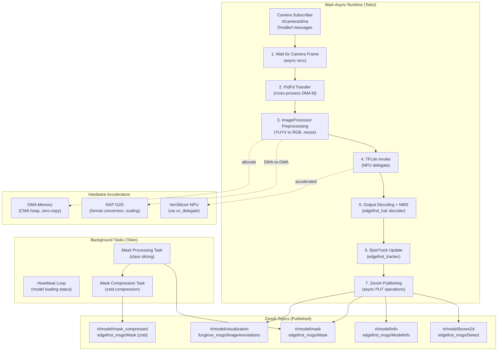
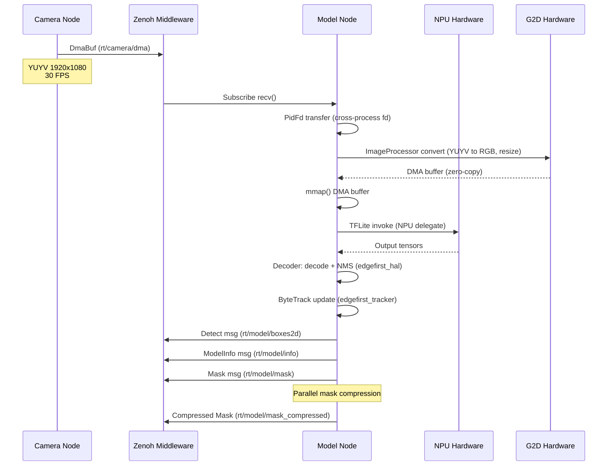
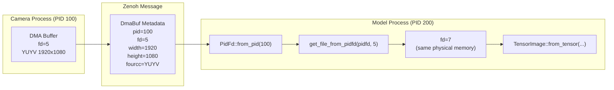
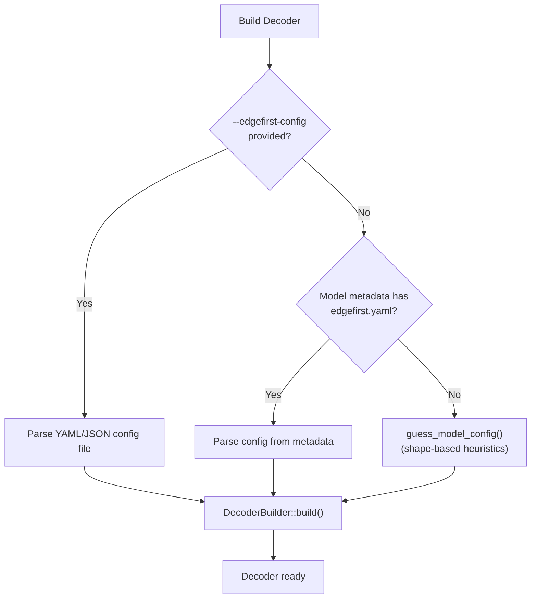
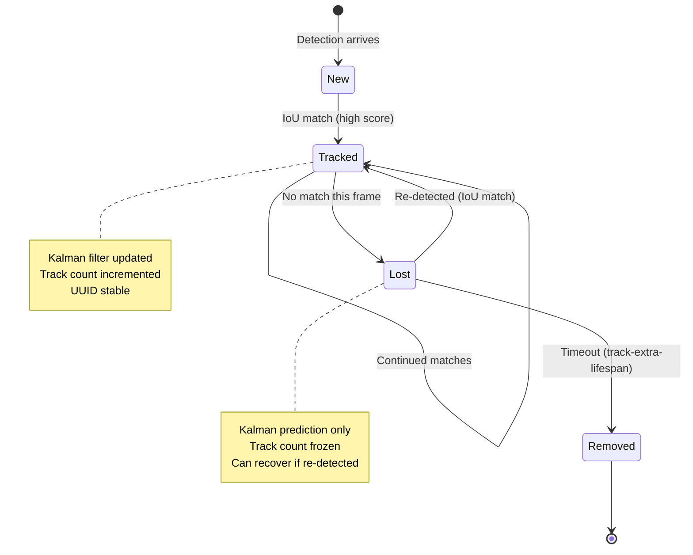

# EdgeFirst Model Node - Architecture

**Technical architecture documentation for developers**

This document describes the internal architecture of the EdgeFirst Model Node, focusing on the async runtime model, data flow patterns, hardware integration, and system design decisions. For user-facing documentation, see [README.md](README.md).

---

## Table of Contents

1. [System Overview](#system-overview)
2. [Module Architecture](#module-architecture)
3. [Data Flow](#data-flow)
4. [Message Formats](#message-formats)
5. [Hardware Integration](#hardware-integration)
6. [Model Identification and Decoding](#model-identification-and-decoding)
7. [Object Tracking](#object-tracking)
8. [Instrumentation and Profiling](#instrumentation-and-profiling)
9. [References](#references)

---

## System Overview

The EdgeFirst Model Node is an asynchronous application built on the Tokio async runtime. It implements a **publish-subscribe pattern** where the main async loop subscribes to camera DMA buffers, performs hardware-accelerated AI inference, and publishes detection results via Zenoh.

### Architecture Diagram



### Key Architectural Properties

- **Async Main Loop**: Single-threaded async runtime for I/O-bound operations (Zenoh subscribe/publish)
- **Zero-Copy DMA**: Camera buffers transferred via PidFd; only metadata crosses process boundaries
- **Hardware Acceleration**: G2D for image preprocessing, NPU for inference (with CPU fallback)
- **Parallel Mask Processing**: Segmentation mask handling runs on separate Tokio tasks for non-blocking pipeline
- **External Tracker**: Multi-object tracking via `edgefirst-tracker` crate (ByteTrack with Kalman filter)
- **External Decoder**: YOLO/ModelPack decoding and NMS via `edgefirst_hal::decoder` module
- **Runtime Dynamic Loading**: Both G2D and TFLite loaded via `libloading` (dlopen) for platform portability
- **Model Agnostic**: Supports TFLite (.tflite) and VAAL RTM (.rtm) models with auto-detection of output formats

---

## Module Architecture

### Crate Boundary

This crate (`edgefirst-model`) is the inference application. It depends on external crates for image processing, decoding, and tracking:

| Concern | Source |
|---------|--------|
| Image preprocessing (G2D) | `edgefirst_hal::image` (`ImageProcessor`) |
| YOLO/ModelPack decoding + NMS | `edgefirst_hal::decoder` (`Decoder`, `DetectBox`) |
| Object tracking (ByteTrack + Kalman) | `edgefirst_tracker` (`ByteTrack`, `TrackInfo`) |
| Message schemas (CDR) | `edgefirst-schemas` (`Detect`, `Box`, `Track`, etc.) |
| TFLite C API bindings | `tflitec-sys` (workspace crate) |
| Pixel format codes | `four-char-code` (`FourCharCode`) |
| G2D FFI bindings | `g2d-sys` (transitive via edgefirst-hal) |

### Source Files in This Crate

```
src/
  main.rs          Application entry, Zenoh session, main inference loop
  lib.rs           TrackerBox wrapper, camera frame helpers, model config guessing
  model.rs         Model trait (enum_dispatch), SupportedModel, Preprocessing, error types
  tflite_model.rs  TFLite runtime integration with NPU delegate
  rtm_model.rs     VAAL RTM model support (feature-gated behind "rtm")
  buildmsgs.rs     Zenoh message construction (Detect, ModelInfo, Mask, ImageAnnotations)
  args.rs          CLI argument parsing (Clap)
  fps.rs           Rolling FPS average calculator
  masks.rs         Async mask slicing and zstd compression tasks
```

---

### Main Application (`main.rs`)

**Responsibilities:**

- Tokio async runtime initialization
- Tracing subscriber setup (stdout, journald, Tracy)
- Zenoh session and topic management
- Camera frame subscription loop
- Model loading and inference orchestration
- Decoder construction (from metadata, config file, or shape-based guessing)
- Result publishing coordination

**Execution Model:**

1. **Initialization:** Parse CLI arguments, configure tracing layers, open Zenoh session
2. **Heartbeat Phase:** Spawn heartbeat task, load model file, build decoder, identify model type
3. **Main Inference Loop:**

```rust
loop {
    let Some(mut dma_buf) = wait_for_camera_frame(&sub_camera, timeout) else { continue; };
    let _fd = update_dmabuf_with_pidfd(&mut dma_buf)?;

    model.load_frame_dmabuf_(&dma_buf, &mut img_proc, Preprocessing::Raw)?;
    model.run_model()?;

    model.decode_outputs(&decoder, &mut output_boxes, &mut output_masks)?;

    if args.track {
        let wrapped: Vec<_> = output_boxes.iter().map(TrackerBox).collect();
        let tracks = tracker.update(&wrapped, timestamp);
        output_tracks.clear();
        output_tracks.extend(tracks.into_iter().flatten());
    }

    // Publish: Detect, ModelInfo, Mask, ImageAnnotations
    fps.update();
    args.tracy.then(frame_mark);
}
```

---

### Core Library (`lib.rs`)

**Public API:**

- `TrackerBox<'a>` -- Newtype wrapper that bridges `edgefirst_hal::decoder::DetectBox` to the `edgefirst_tracker::DetectionBox` trait
- `wait_for_camera_frame()` -- Async camera frame receive with timeout, drains backlog
- `update_dmabuf_with_pidfd()` -- Cross-process DMA fd transfer via PidFd
- `heart_beat()` -- Background task publishing empty messages while model loads
- `get_curr_time()` -- Monotonic clock timestamp
- `guess_model_config()` -- Shape-based heuristic to produce a `ConfigOutputs` when no metadata is available
- `ModelTypeActual` -- Describes model capabilities (detection, segmentation, instance segmentation)

**TrackerBox Bridge:**

The `TrackerBox` wrapper implements `edgefirst_tracker::DetectionBox` for `edgefirst_hal::decoder::DetectBox`, enabling the tracker to consume decoder output without tight coupling between the two crates:

```rust
pub struct TrackerBox<'a>(pub &'a edgefirst_hal::decoder::DetectBox);

impl edgefirst_tracker::DetectionBox for TrackerBox<'_> {
    fn bbox(&self) -> [f32; 4] {
        [self.0.bbox.xmin, self.0.bbox.ymin, self.0.bbox.xmax, self.0.bbox.ymax]
    }
    fn score(&self) -> f32 { self.0.score }
    fn label(&self) -> usize { self.0.label }
}
```

---

### Model Abstraction (`model.rs`)

**Design:** `enum_dispatch` pattern for runtime polymorphism without vtable overhead.

**Core Trait:**

```rust
#[enum_dispatch]
pub trait Model {
    fn model_name(&self) -> Result<String, ModelError>;
    fn load_frame_dmabuf_(&mut self, dmabuf: &DmaBuffer, img_proc: &mut ImageProcessor,
                          preprocessing: Preprocessing) -> Result<(), ModelError>;
    fn run_model(&mut self) -> Result<(), ModelError>;

    fn input_count(&self) -> Result<usize, ModelError>;
    fn input_shape(&self, index: usize) -> Result<Vec<usize>, ModelError>;
    fn input_type(&self, index: usize) -> Result<DataType, ModelError>;
    fn load_input(&mut self, index: usize, data: &[u8], channels: usize,
                  preprocessing: Preprocessing) -> Result<(), ModelError>;

    fn output_count(&self) -> Result<usize, ModelError>;
    fn output_shape(&self, index: usize) -> Result<Vec<usize>, ModelError>;
    fn output_type(&self, index: usize) -> Result<DataType, ModelError>;
    fn output_data<T: Copy>(&self, index: usize, data: &mut [T]) -> Result<(), ModelError>;
    fn output_quantization(&self, index: usize) -> Result<Option<(f32, i32)>, ModelError>;

    fn labels(&self) -> Result<Vec<String>, ModelError>;
    fn decode_outputs(&self, decoder: &Decoder, output_boxes: &mut Vec<DetectBox>,
                      output_masks: &mut Vec<Segmentation>) -> Result<(), ModelError>;
    fn decode_outputs_tracked(&self, decoder: &Decoder, output_boxes: &mut Vec<DetectBox>,
                              output_masks: &mut Vec<Segmentation>,
                              output_tracks: &mut Vec<TrackInfo>,
                              timestamp: u64) -> Result<(), ModelError>;
    fn get_model_metadata(&self) -> Result<Metadata, ModelError>;
}
```

**Supported Implementations:**

```rust
#[enum_dispatch(Model)]
pub enum SupportedModel<'a> {
    TfLiteModel(TFLiteModel<'a>),
    #[cfg(feature = "rtm")]
    RtmModel(RtmModel),
}
```

**Key Types from External Crates:**

- `DetectBox` (from `edgefirst_hal::decoder`) -- Bounding box with `bbox: BoundingBox { xmin, ymin, xmax, ymax }`, `score: f32`, `label: usize`
- `Segmentation` (from `edgefirst_hal::decoder`) -- Decoded segmentation mask output
- `Decoder` (from `edgefirst_hal::decoder`) -- Configured decoder instance built via `DecoderBuilder`
- `ImageProcessor` (from `edgefirst_hal::image`) -- G2D-backed image conversion (replaces former local `ImageManager`)

**Preprocessing Modes:**

```rust
pub enum Preprocessing {
    Raw,            // No normalization (uint8 -> uint8)
    UnsignedNorm,   // [0, 255] -> [0.0, 1.0]
    SignedNorm,     // [0, 255] -> [-1.0, 1.0]
    ImageNet,       // ImageNet mean/std normalization
}
```

---

### TFLite Model (`tflite_model.rs`)

**Purpose:** TensorFlow Lite runtime integration with NPU delegate support.

**Runtime Loading:** The `TFLiteLib` struct uses `libloading` to dynamically load `libtensorflowlite_c.so`:
- **NPU Delegate:** `libvx_delegate.so` (VeriSilicon NPU acceleration)
- **CPU Fallback:** Built-in XNNPACK delegate if NPU unavailable

**Metadata Extraction:** TFLite models can embed `edgefirst.yaml` configuration in FlatBuffers metadata, including output decoder types, shapes, preprocessing, and label strings.

---

### RTM Model (`rtm_model.rs`)

**Purpose:** VAAL/DeepViewRT model support, feature-gated behind the `rtm` Cargo feature.

---

### Message Construction (`buildmsgs.rs`)

**Purpose:** Build and serialize all published Zenoh messages (CDR format).

**Functions:**

- `build_detect_msg_and_encode_()` -- Constructs `Detect` message with boxes, tracks, timing
- `build_model_info_msg()` -- Constructs `ModelInfo` message with model metadata
- `build_segmentation_msg_()` -- Constructs `Mask` message from decoder segmentation output
- `build_image_annotations_msg_and_encode_()` -- Constructs Foxglove `ImageAnnotations` for visualization
- `convert_boxes()` -- Converts `DetectBox` + `TrackInfo` to the schema `Box` type
- `time_from_ns()` -- Converts nanosecond timestamp to `Time` struct

---

### Mask Processing (`masks.rs`)

**Purpose:** Asynchronous segmentation mask handling and publishing.

**Background Tasks:**

1. **`mask_thread()`** -- Receives masks via mpsc channel, optionally slices to specific classes (`--mask-classes`), publishes to `rt/model/mask`, forwards to compression task if enabled
2. **`mask_compress_thread()`** -- Compresses masks using zstd (`--mask-compression-level`), publishes to `rt/model/mask_compressed`

**Non-Blocking Design:** Mask processing runs in parallel with the main inference loop. Bounded channels (size 50) provide backpressure. `drain_recv()` ensures the latest mask is processed if a backlog occurs.

---

### CLI Arguments (`args.rs`)

**Purpose:** Clap-based argument parsing. Key arguments include model path, engine selection (NPU/CPU), score threshold, IOU threshold, tracking parameters, mask compression settings, Zenoh connection options, and Tracy profiler toggle.

---

### FPS Calculator (`fps.rs`)

**Purpose:** Const-generic rolling average FPS calculator. `Fps<N>` tracks frame times over the last N frames and logs periodic min/max/avg statistics.

---

## Data Flow

### End-to-End Pipeline



### Zero-Copy DMA Transfer

The EdgeFirst ecosystem uses **PidFd-based file descriptor passing** for zero-copy DMA sharing:



**Key Points:**

- Only metadata (file descriptor number, dimensions, format) is serialized
- Physical memory is never copied between processes
- Kernel handles translation: `PidFd + remote_fd -> local_fd`
- Requires same permissions for both processes (both root or same user)

---

## Message Formats

All messages use **ROS2 CDR (Common Data Representation)** serialization for ecosystem compatibility.

### DmaBuf Message (Subscribed)

```rust
// edgefirst_msgs/DmaBuf (from edgefirst-schemas)
pub struct DmaBuffer {
    pub header: Header,           // ROS2 standard header (timestamp, frame_id)
    pub fd: i32,                  // Source process file descriptor
    pub offset: u64,              // Offset into DMA buffer
    pub stride: u32,              // Row stride (bytes per line)
    pub width: u32,               // Image width
    pub height: u32,              // Image height
    pub length: u32,              // Total buffer size
    pub fourcc: u32,              // Pixel format (YUYV, NV12, etc.)
    pub pid: u32,                 // Source process ID (for PidFd transfer)
}
```

---

### Detect Message (Published)

```rust
// edgefirst_msgs/Detect (from edgefirst-schemas)
pub struct Detect {
    pub header: Header,
    pub input_timestamp: Time,    // Input preprocessing duration
    pub model_time: Time,         // Inference duration
    pub output_time: Time,        // Output decoding duration
    pub boxes: Vec<Box>,
}

pub struct Box {
    pub center_x: f32,            // Normalized [0.0, 1.0]
    pub center_y: f32,
    pub width: f32,
    pub height: f32,
    pub label: String,            // "person", "car", etc.
    pub score: f32,               // Confidence score
    pub distance: f32,            // Reserved (0.0)
    pub speed: f32,               // Reserved (0.0)
    pub track: Track,
}

pub struct Track {
    pub id: String,               // Track UUID (if tracking enabled)
    pub lifetime: i32,            // Track age (update count)
    pub created: Time,            // Track creation timestamp
}
```

**Published Rate:** Same as camera FPS (typically 30 Hz)

---

### ModelInfo Message (Published)

```rust
// edgefirst_msgs/ModelInfo (from edgefirst-schemas)
pub struct ModelInfo {
    pub header: Header,
    pub labels: Vec<String>,      // Class names
    pub input_shape: Vec<u32>,    // Model input dimensions
    pub input_type: u8,           // Input tensor data type
    pub output_shape: Vec<u32>,   // First output dimensions
    pub output_type: u8,          // Output tensor data type
    pub model_format: String,     // "TFLite", "DeepViewRT", etc.
    pub model_name: String,       // Model name from metadata or filename
    pub model_type: String,       // "Detection", "Segmentation", "Detection;Segmentation"
}
```

---

### Mask Message (Published)

```rust
// edgefirst_msgs/Mask (from edgefirst-schemas)
pub struct Mask {
    pub height: u32,
    pub width: u32,
    pub length: u32,              // Number of frames (always 1)
    pub encoding: String,         // "" (raw) or "zstd" (compressed)
    pub mask: Vec<u8>,            // HxWxC mask data (C = number of classes)
    pub boxed: bool,
}
```

**Class Slicing:** The `--mask-classes` argument filters masks to specific class indices, reducing bandwidth for applications that only need specific objects.

---

### ImageAnnotations Message (Published, Optional)

Foxglove Studio visualization overlays, enabled with `--visualization` flag. Bounding boxes are rendered as `LINE_LOOP` point annotations with class label text annotations. Coordinates are in absolute pixel space (scaled from normalized). Published on `rt/model/visualization`.

---

## Hardware Integration

### NXP G2D - Graphics 2D Accelerator

**Device:** `/dev/galcore` (NXP i.MX8M Plus SoC)

**FFI Bindings:** `g2d-sys` crate (transitive via `edgefirst-hal`)

**Access:** Through `edgefirst_hal::image::ImageProcessor`, which wraps G2D device operations including format conversion (YUYV to RGB), scaling, cropping, and rotation. The `ImageProcessor` uses `libloading` to dynamically load `libg2d.so.2` at runtime.

**Performance:** 1920x1080 YUYV to 640x640 RGB in ~2-5ms (vs ~15-30ms CPU). DMA-to-DMA operation with no CPU memory bandwidth consumption.

---

### VeriSilicon NPU - Neural Processing Unit

**Delegate:** `libvx_delegate.so` (TFLite external delegate)

**Fallback:** If NPU delegate fails to load, TFLite falls back to CPU execution via built-in XNNPACK delegate (~10-50x slower depending on model).

**Quantization Support:** Int8, UInt8, Float32, Float16 -- all with full NPU acceleration.

---

### DMA Memory Allocation

**Heap:** Linux DMA-BUF heap (CMA - Contiguous Memory Allocator)

DMA buffers are allocated from physically contiguous memory, required for G2D hardware. Buffers are shared between processes via PidFd, and between CPU and hardware accelerators. The `TensorImage` type (from `edgefirst_hal::image`) wraps a DMA-backed tensor with pixel format metadata.

---

## Model Identification and Decoding

### Decoder Construction

The `Decoder` (from `edgefirst_hal::decoder`) is constructed via `DecoderBuilder` using one of three configuration sources, in priority order:

1. **External config file** (`--edgefirst-config path.yaml`): Explicit YAML/JSON configuration
2. **Model metadata**: `edgefirst.yaml` embedded in TFLite model FlatBuffers metadata
3. **Shape-based guessing** (fallback): Heuristic analysis of output tensor shapes via `guess_model_config()`



### Shape-Based Guessing

When no configuration is available, `guess_model_config()` in `lib.rs` analyzes output tensor shapes to produce a `ConfigOutputs`. It attempts to match patterns for:

- **YOLO detection:** Single 3D output `[1, NF, NB]` or `[1, NB, NF]`
- **YOLO segmentation+detection:** 4D protos + 3D detection
- **YOLO split outputs:** Separate boxes `[1, 4, NB]` + scores `[1, NC, NB]`
- **ModelPack detection:** 4D boxes `[1, NB, 1, 4]` + 3D scores `[1, NB, NC]`
- **ModelPack segmentation:** 4D output with H,W >= 160
- **ModelPack segmentation+detection:** 3 or 4 output combinations

### Supported Model Types

The `Decoder` identifies the following model types from configuration:

| Model Type | Description |
|------------|-------------|
| `YoloDet` | YOLO detection (single combined output) |
| `YoloSegDet` | YOLO segmentation + detection |
| `YoloSplitDet` | YOLO detection with split boxes/scores outputs |
| `YoloSplitSegDet` | YOLO segmentation + detection with split outputs |
| `YoloEndToEndDet` | End-to-end YOLO detection (NMS built into model) |
| `YoloEndToEndSegDet` | End-to-end YOLO segmentation + detection |
| `ModelPackDet` | ModelPack detection |
| `ModelPackDetSplit` | ModelPack detection with split outputs |
| `ModelPackSeg` | ModelPack segmentation only |
| `ModelPackSegDet` | ModelPack segmentation + detection |
| `ModelPackSegDetSplit` | ModelPack segmentation + detection with split outputs |

### Decoder Versions

The `DecoderVersion` enum controls variant-specific decoding behavior:

- `Yolov5` -- Anchor-based + sigmoid activation
- `Yolov8` -- Anchor-free + DFL (Distribution Focal Loss)
- `Yolo11` -- Latest YOLO architecture (same decoding as YOLOv8)
- `Yolo26` -- YOLO v26

All decoding logic and NMS are implemented in the `edgefirst_hal::decoder` module, not in this crate.

---

## Object Tracking

### ByteTrack Algorithm

**Crate:** `edgefirst-tracker` (0.6.2)

**Paper:** [ByteTrack: Multi-Object Tracking by Associating Every Detection Box](https://arxiv.org/abs/2110.06864)

ByteTrack associates **both high and low confidence** detections in two passes:

1. **First Pass:** Match high-confidence detections to existing tracklets (IoU metric)
2. **Second Pass:** Match low-confidence detections to remaining unmatched tracklets
3. **Kalman Prediction:** Use predicted positions for occluded/missed detections

### Integration

Tracking is **decoupled** from decoding. After `model.decode_outputs()` produces detection boxes, the main loop wraps them via `TrackerBox` and calls the tracker separately:

```rust
if args.track {
    let wrapped: Vec<_> = output_boxes.iter().map(TrackerBox).collect();
    let tracks = tracker.update(&wrapped, timestamp);
    output_tracks.clear();
    output_tracks.extend(tracks.into_iter().flatten());
}
```

### Configuration

Tracking parameters are exposed as CLI arguments:

| Argument | Default | Description |
|----------|---------|-------------|
| `--track` | false | Enable tracking |
| `--track-extra-lifespan` | 0.5s | Seconds a lost track survives before removal |
| `--track-high-conf` | 0.7 | High confidence threshold for first-pass association |
| `--track-iou` | 0.25 | IoU threshold for box-to-track association |
| `--track-update` | 0.25 | Kalman filter update factor (0.0 to 1.0) |

### Tracking Lifecycle



The Kalman filter uses a **constant velocity model** with XYAH (center x, center y, aspect ratio, height) representation. The Hungarian algorithm (LAPJV) matches detections to predictions via IoU cost matrix. All tracking internals (Kalman filter, LAPJV, tracklet management) are implemented in the `edgefirst-tracker` crate.

---

## Instrumentation and Profiling

### Tracing Architecture

The application configures `tracing-subscriber` with multiple layers:

1. **stdout_log** -- Console output with pretty formatting (filter: `RUST_LOG`, default: INFO)
2. **journald** -- systemd journal integration (filter: `RUST_LOG`, default: INFO)
3. **tracy** -- Tracy profiler integration (optional, `--tracy` flag)

### Tracy Integration

Tracy is enabled by default via the `tracy` Cargo feature. The `--tracy` CLI flag activates the tracing layer at runtime.

**Frame Markers:** `frame_mark()` called at end of each inference loop iteration.

**Span Zones:** Automatic from `#[instrument]` attributes and manual `info_span!()` calls on performance-critical sections.

**Profiling Build:**

```bash
cargo build --profile profiling --features profiling
```

Adds memory profiling, CPU sampling, and context switch tracing.

### Span Hierarchy

```
main_loop (30 FPS, 33ms period)
  wait_for_camera_frame (0.1-10ms)
  load_frame_dmabuf_ (2-5ms, includes G2D)
  run_model (10-50ms, depending on model)
  decode_outputs (1-3ms, includes NMS)
  tracker_update (0.2-1ms)
  zenoh_publish (0.1-1ms)
```

---

## References

**Key Dependencies:**

- [edgefirst-hal](https://crates.io/crates/edgefirst-hal) (0.6.2) -- Image processing, YOLO/ModelPack decoding, NMS
- [edgefirst-tracker](https://crates.io/crates/edgefirst-tracker) (0.6.2) -- ByteTrack multi-object tracking, Kalman filter
- [edgefirst-schemas](https://crates.io/crates/edgefirst-schemas) (1.5.3) -- CDR message schemas
- [four-char-code](https://crates.io/crates/four-char-code) (2.3.0) -- FourCharCode pixel format type
- [zenoh](https://zenoh.io/) (1.5.0) -- Pub/sub middleware
- [tokio](https://tokio.rs/) -- Async runtime
- [tflitec-sys](tflitec-sys/) -- TensorFlow Lite C API FFI bindings (workspace crate)
- [ndarray](https://docs.rs/ndarray/) -- N-dimensional array library

**Hardware Documentation:**

- [NXP i.MX8M Plus Reference Manual](https://www.nxp.com/docs/en/reference-manual/IMX8MPRM.pdf)
- [Linux DMA-BUF Subsystem](https://www.kernel.org/doc/html/latest/driver-api/dma-buf.html)

**Papers:**

- [ByteTrack: Multi-Object Tracking by Associating Every Detection Box](https://arxiv.org/abs/2110.06864)
- [YOLOv8 Documentation](https://docs.ultralytics.com/)

**EdgeFirst Ecosystem:**

- [EdgeFirst Camera Node](../camera/) -- DMA buffer producer
- [EdgeFirst Studio](https://www.edgefirst.ai/) -- Cloud MLOps platform
- [Au-Zone Technologies](https://www.au-zone.com/) -- Commercial support and services
