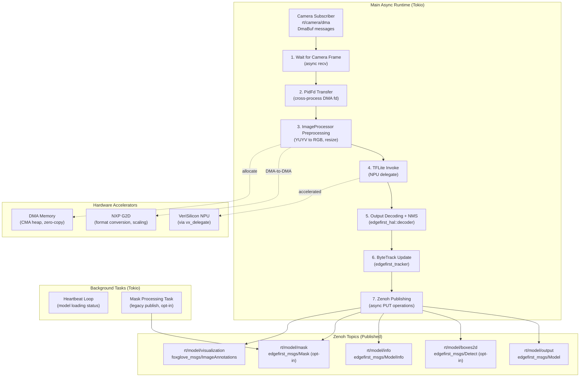
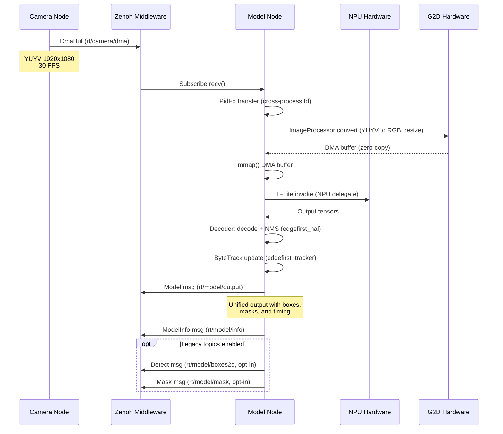
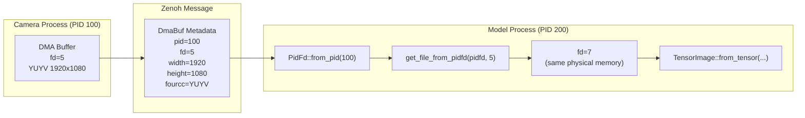
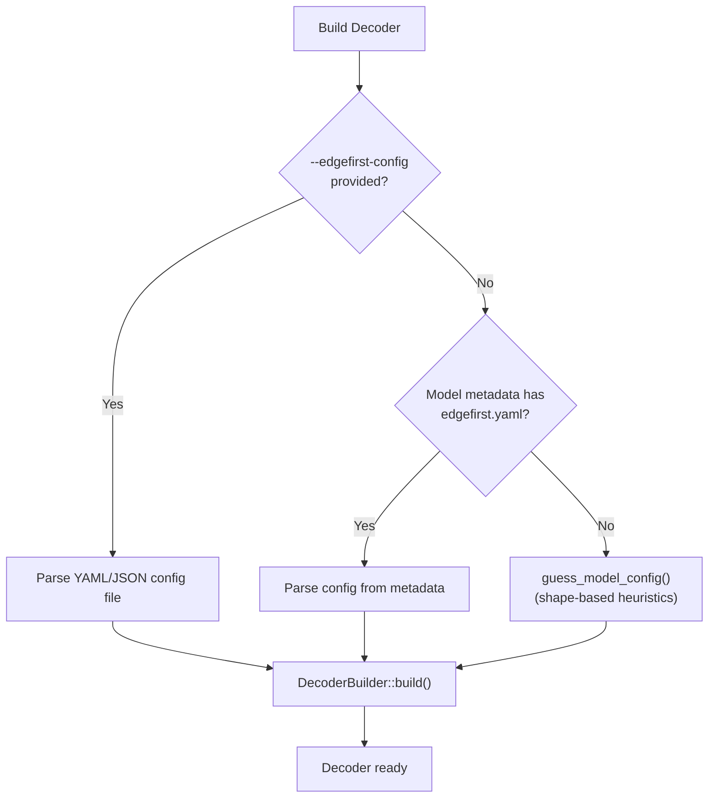
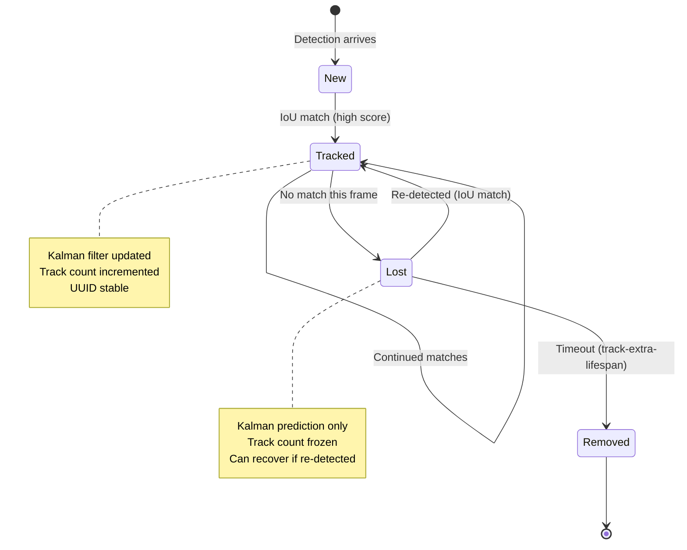

# EdgeFirst Model Node - Architecture

**Technical architecture documentation for developers**

This document describes the internal architecture of the EdgeFirst Model Node, focusing on the async runtime model, data flow patterns, hardware integration, and system design decisions. For user-facing documentation, see [README.md](README.md).

---

## Table of Contents

1. [System Overview](#system-overview)
2. [Module Architecture](#module-architecture)
3. [Data Flow](#data-flow)
4. [Message Formats](#message-formats)
5. [Hardware Integration](#hardware-integration)
6. [Model Identification and Decoding](#model-identification-and-decoding)
7. [Object Tracking](#object-tracking)
8. [Instrumentation and Profiling](#instrumentation-and-profiling)
9. [References](#references)

---

## System Overview

The EdgeFirst Model Node is an asynchronous application built on the Tokio async runtime. It implements a **publish-subscribe pattern** where the main async loop subscribes to camera DMA buffers, performs hardware-accelerated AI inference, and publishes detection results via Zenoh.

### Architecture Diagram


```mermaid
graph TB
    subgraph "Main Async Runtime (Tokio)"
        CamSub["Camera Subscriber<br/>rt/camera/dma<br/>DmaBuf messages"]
        WaitFrame["1. Wait for Camera Frame<br/>(async recv)"]
        PidFd["2. PidFd Transfer<br/>(cross-process DMA fd)"]
        G2DPrep["3. ImageProcessor Preprocessing<br/>(YUYV to RGB, resize)"]
        Inference["4. TFLite Invoke<br/>(NPU delegate)"]
        Decode["5. Output Decoding + NMS<br/>(edgefirst_hal::decoder)"]
        Track["6. ByteTrack Update<br/>(edgefirst_tracker)"]
        Publish["7. Zenoh Publishing<br/>(async PUT operations)"]

        CamSub --> WaitFrame
        WaitFrame --> PidFd
        PidFd --> G2DPrep
        G2DPrep --> Inference
        Inference --> Decode
        Decode --> Track
        Track --> Publish
    end

    subgraph "Background Tasks (Tokio)"
        Heartbeat["Heartbeat Loop<br/>(model loading status)"]
        MaskTask["Mask Processing Task<br/>(legacy publish, opt-in)"]
    end

    subgraph "Zenoh Topics (Published)"
        OutputTop["rt/model/output<br/>edgefirst_msgs/Model"]
        InfoTop["rt/model/info<br/>edgefirst_msgs/ModelInfo"]
        DetectTop["rt/model/boxes2d<br/>edgefirst_msgs/Detect (opt-in)"]
        MaskTop["rt/model/mask<br/>edgefirst_msgs/Mask (opt-in)"]
        VisualTop["rt/model/visualization<br/>foxglove_msgs/ImageAnnotations"]
    end

    subgraph "Hardware Accelerators"
        NPU["VeriSilicon NPU<br/>(via vx_delegate)"]
        G2D["NXP G2D<br/>(format conversion, scaling)"]
        DMA["DMA Memory<br/>(CMA heap, zero-copy)"]
    end

    Publish --> OutputTop
    Publish --> DetectTop
    Publish --> InfoTop
    Publish --> MaskTop
    Publish --> VisualTop

    MaskTask --> MaskTop

    G2DPrep -.->|"DMA-to-DMA"| G2D
    Inference -.->|"accelerated"| NPU
    G2DPrep -.->|"allocate"| DMA
```

### Key Architectural Properties

- **Async Main Loop**: Single-threaded async runtime for I/O-bound operations (Zenoh subscribe/publish)
- **Zero-Copy DMA**: Camera buffers transferred via PidFd; only metadata crosses process boundaries
- **Hardware Acceleration**: G2D for image preprocessing, NPU for inference (with CPU fallback)
- **Parallel Mask Processing**: Segmentation mask handling runs on a separate Tokio task when the legacy mask topic is enabled
- **External Tracker**: Multi-object tracking via `edgefirst-tracker` crate (ByteTrack with Kalman filter)
- **External Decoder**: YOLO/ModelPack decoding and NMS via `edgefirst_hal::decoder` module
- **Runtime Dynamic Loading**: G2D loaded via `libloading` (dlopen), TFLite via `edgefirst-tflite`
- **3-Tier Preprocessing**: Auto-selects CameraAdaptor+DMA-BUF, DMA-BUF only, or CPU fallback at startup

---

## Module Architecture

### Crate Boundary

This crate (`edgefirst-model`) is the inference application. It depends on external crates for image processing, decoding, and tracking:

| Concern | Source |
|---------|--------|
| Image preprocessing (G2D) | `edgefirst_hal::image` (`ImageProcessor`) |
| YOLO/ModelPack decoding + NMS | `edgefirst_hal::decoder` (`Decoder`, `DetectBox`) |
| Object tracking (ByteTrack + Kalman) | `edgefirst_tracker` (`ByteTrack`, `TrackInfo`) |
| Message schemas (CDR) | `edgefirst-schemas` (`Detect`, `Box`, `Track`, etc.) |
| TFLite inference | `edgefirst-tflite` (`Library`, `Model`, `Interpreter`, `Delegate`) |
| Pixel format codes | `four-char-code` (`FourCharCode`) |
| G2D FFI bindings | `g2d-sys` (transitive via edgefirst-hal) |

### Source Files in This Crate

```
src/
  main.rs          Application entry, Zenoh session, 3-tier inference loop
  lib.rs           TrackerBox wrapper, camera frame helpers, heartbeat
  model.rs         ModelContext struct, decode_outputs, model config guessing, error types
  buildmsgs.rs     Zenoh message construction (Detect, ModelInfo, Mask, ImageAnnotations)
  args.rs          CLI argument parsing (Clap)
  fps.rs           Rolling FPS average calculator
  masks.rs         Async mask publishing (legacy mask topic)
```

---

### Main Application (`main.rs`)

**Responsibilities:**

- Tokio async runtime initialization
- Tracing subscriber setup (stdout, journald, Tracy)
- Zenoh session and topic management
- Camera frame subscription loop
- Model loading and inference orchestration
- Decoder construction (from metadata, config file, or shape-based guessing)
- Result publishing coordination

**Execution Model:**

1. **Initialization:** Parse CLI arguments, configure tracing layers, open Zenoh session
2. **Heartbeat Phase:** Spawn heartbeat task, load model file, build decoder, identify model type
3. **Main Inference Loop (3-tier preprocessing):**

```rust
loop {
    let Some(mut dma_buf) = wait_for_camera_frame(&sub_camera, timeout) else { continue; };
    let _fd = update_dmabuf_with_pidfd(&mut dma_buf)?;

    // Tier 1: CameraAdaptor+DMA-BUF (mmap RGBA to input tensor)
    // Tier 2: DMA-BUF only (CPU type-convert into tensor)
    // Tier 3: CPU fallback (system memory)
    img_proc.convert(&src_image, &dst_image)?;
    // ... copy pixels into interpreter input tensor ...

    interpreter.invoke()?;
    decode_outputs(&interpreter, &decoder, &mut output_boxes, &mut output_masks)?;

    if args.track {
        let wrapped: Vec<_> = output_boxes.iter().map(TrackerBox).collect();
        let tracks = tracker.update(&wrapped, timestamp);
        output_tracks.clear();
        output_tracks.extend(tracks.into_iter().flatten());
    }

    // Publish: Model (unified output), Detect (legacy), ModelInfo, Mask (legacy), ImageAnnotations
    fps.update();
    args.tracy.then(frame_mark);
}
```

---

### Core Library (`lib.rs`)

**Public API:**

- `TrackerBox<'a>` -- Newtype wrapper that bridges `edgefirst_hal::decoder::DetectBox` to the `edgefirst_tracker::DetectionBox` trait
- `wait_for_camera_frame()` -- Async camera frame receive with timeout, drains backlog
- `update_dmabuf_with_pidfd()` -- Cross-process DMA fd transfer via PidFd
- `heart_beat()` -- Background task publishing empty messages while model loads
- `get_curr_time()` -- Monotonic clock timestamp
- `guess_model_config()` -- Shape-based heuristic to produce a `ConfigOutputs` when no metadata is available (defined in `model.rs`)
- `ModelTypeActual` -- Describes model capabilities (detection, segmentation, instance segmentation)

**TrackerBox Bridge:**

The `TrackerBox` wrapper implements `edgefirst_tracker::DetectionBox` for `edgefirst_hal::decoder::DetectBox`, enabling the tracker to consume decoder output without tight coupling between the two crates:

```rust
pub struct TrackerBox<'a>(pub &'a edgefirst_hal::decoder::DetectBox);

impl edgefirst_tracker::DetectionBox for TrackerBox<'_> {
    fn bbox(&self) -> [f32; 4] {
        [self.0.bbox.xmin, self.0.bbox.ymin, self.0.bbox.xmax, self.0.bbox.ymax]
    }
    fn score(&self) -> f32 { self.0.score }
    fn label(&self) -> usize { self.0.label }
}
```

---

### Model Context (`model.rs`)

**Design:** Simple data struct (`ModelContext`) holds model metadata for message building. No trait abstraction — `edgefirst-tflite` `Interpreter` is used directly in `main.rs`.

**Core Struct:**

```rust
pub struct ModelContext {
    pub input_shapes: Vec<Vec<usize>>,
    pub input_types: Vec<DataType>,
    pub output_shapes: Vec<Vec<usize>>,
    pub output_types: Vec<DataType>,
    pub labels: Vec<String>,
    pub name: String,
}
```

**Key Function:**

```rust
pub fn decode_outputs(
    interpreter: &Interpreter,
    decoder: &Decoder,
    output_boxes: &mut Vec<DetectBox>,
    output_masks: &mut Vec<Segmentation>,
) -> Result<(), ModelError>
```

Reads output tensors from the interpreter and feeds them through the HAL decoder for NMS, box extraction, and mask decoding.

**Key Types from External Crates:**

- `DetectBox` (from `edgefirst_hal::decoder`) -- Bounding box with `bbox: BoundingBox { xmin, ymin, xmax, ymax }`, `score: f32`, `label: usize`
- `Segmentation` (from `edgefirst_hal::decoder`) -- Decoded segmentation mask output
- `Decoder` (from `edgefirst_hal::decoder`) -- Configured decoder instance built via `DecoderBuilder`
- `ImageProcessor` (from `edgefirst_hal::image`) -- G2D-backed image conversion
- `Interpreter` (from `edgefirst-tflite`) -- TFLite interpreter with optional delegate

**TFLite Integration:**

The `edgefirst-tflite` crate provides:
- `Library` — dynamically loads `libtensorflowlite_c.so`
- `Model` — parses the FlatBuffer model
- `Delegate` — loads delegate .so (e.g. `libvx_delegate.so` for NPU)
- `Interpreter` — runs inference, provides typed tensor access

**Metadata Extraction:** TFLite models can embed `edgefirst.yaml` configuration in zip metadata, including output decoder types, shapes, and label strings.

---

### Message Construction (`buildmsgs.rs`)

**Purpose:** Build and serialize all published Zenoh messages (CDR format).

**Functions:**

- `build_model_output_msg()` -- Constructs the unified `Model` message with boxes, masks, and timing durations. Handles all three model types: detection-only (empty masks), semantic segmentation (single mask with `boxed: false`), and instance segmentation (one mask per box with `boxed: true`)
- `build_detect_msg_and_encode_()` -- Constructs legacy `Detect` message with boxes, tracks, timing
- `build_model_info_msg()` -- Constructs `ModelInfo` message with model metadata
- `build_segmentation_msg_()` -- Constructs legacy `Mask` message from decoder segmentation output (semantic segmentation only)
- `build_image_annotations_msg_and_encode_()` -- Constructs Foxglove `ImageAnnotations` for visualization
- `convert_boxes()` -- Converts `DetectBox` + `TrackInfo` to the schema `Box` type (shared by both `Model` and `Detect` messages)
- `time_from_ns()` -- Converts nanosecond timestamp to `Time` struct
- `duration_from_ns()` -- Converts nanosecond duration to `Duration` struct (used by `Model` message timing fields)

---

### Mask Processing (`masks.rs`)

**Purpose:** Asynchronous segmentation mask handling and publishing for the legacy mask topic.

**Background Task:**

- **`mask_thread()`** -- Receives masks via mpsc channel and publishes to the legacy mask topic. Only spawned when `mask_topic` is non-empty.

**Non-Blocking Design:** Mask processing runs in parallel with the main inference loop. Bounded channels (size 50) provide backpressure. `drain_recv()` ensures the latest mask is processed if a backlog occurs.

---

### CLI Arguments (`args.rs`)

**Purpose:** Clap-based argument parsing. Key arguments include model path, delegate path (empty = CPU), score threshold, IOU threshold, tracking parameters, class label filtering (`--classes`), topic configuration, Zenoh connection options, and Tracy profiler toggle. All topic fields support environment variable configuration via `env` attributes for systemd EnvironmentFile integration. Legacy topics (`detect_topic`, `mask_topic`) default to empty (disabled).

---

### FPS Calculator (`fps.rs`)

**Purpose:** Const-generic rolling average FPS calculator. `Fps<N>` tracks frame times over the last N frames and logs periodic min/max/avg statistics.

---

## Data Flow

### End-to-End Pipeline


```mermaid
sequenceDiagram
    participant Camera as Camera Node
    participant Zenoh as Zenoh Middleware
    participant Model as Model Node
    participant NPU as NPU Hardware
    participant G2D as G2D Hardware

    Camera->>Zenoh: DmaBuf (rt/camera/dma)
    Note over Camera: YUYV 1920x1080<br/>30 FPS

    Zenoh->>Model: Subscribe recv()
    Model->>Model: PidFd transfer (cross-process fd)

    Model->>G2D: ImageProcessor convert (YUYV to RGB, resize)
    G2D-->>Model: DMA buffer (zero-copy)

    Model->>Model: mmap() DMA buffer
    Model->>NPU: TFLite invoke (NPU delegate)
    NPU-->>Model: Output tensors

    Model->>Model: Decoder: decode + NMS (edgefirst_hal)
    Model->>Model: ByteTrack update (edgefirst_tracker)

    Model->>Zenoh: Model msg (rt/model/output)
    Note over Model: Unified output with boxes,<br/>masks, and timing
    Model->>Zenoh: ModelInfo msg (rt/model/info)
    opt Legacy topics enabled
    Model->>Zenoh: Detect msg (rt/model/boxes2d, opt-in)
    Model->>Zenoh: Mask msg (rt/model/mask, opt-in)
    end
```

### Zero-Copy DMA Transfer

The EdgeFirst ecosystem uses **PidFd-based file descriptor passing** for zero-copy DMA sharing:


```mermaid
graph LR
    subgraph "Camera Process (PID 100)"
        CamDMA["DMA Buffer<br/>fd=5<br/>YUYV 1920x1080"]
    end

    subgraph "Zenoh Message"
        Meta["DmaBuf Metadata<br/>pid=100<br/>fd=5<br/>width=1920<br/>height=1080<br/>fourcc=YUYV"]
    end

    subgraph "Model Process (PID 200)"
        PidFd["PidFd::from_pid(100)"]
        GetFd["get_file_from_pidfd(pidfd, 5)"]
        NewFd["fd=7<br/>(same physical memory)"]
        TImg["TensorImage::from_tensor(...)"]
    end

    CamDMA --> Meta
    Meta --> PidFd
    PidFd --> GetFd
    GetFd --> NewFd
    NewFd --> TImg
```

**Key Points:**

- Only metadata (file descriptor number, dimensions, format) is serialized
- Physical memory is never copied between processes
- Kernel handles translation: `PidFd + remote_fd -> local_fd`
- Requires same permissions for both processes (both root or same user)

---

## Message Formats

All messages use **ROS2 CDR (Common Data Representation)** serialization for ecosystem compatibility.

### DmaBuf Message (Subscribed)

```rust
// edgefirst_msgs/DmaBuf (from edgefirst-schemas)
pub struct DmaBuffer {
    pub header: Header,           // ROS2 standard header (timestamp, frame_id)
    pub fd: i32,                  // Source process file descriptor
    pub offset: u64,              // Offset into DMA buffer
    pub stride: u32,              // Row stride (bytes per line)
    pub width: u32,               // Image width
    pub height: u32,              // Image height
    pub length: u32,              // Total buffer size
    pub fourcc: u32,              // Pixel format (YUYV, NV12, etc.)
    pub pid: u32,                 // Source process ID (for PidFd transfer)
}
```

---

### Detect Message (Published)

```rust
// edgefirst_msgs/Detect (from edgefirst-schemas)
pub struct Detect {
    pub header: Header,
    pub input_timestamp: Time,    // Input preprocessing duration
    pub model_time: Time,         // Inference duration
    pub output_time: Time,        // Output decoding duration
    pub boxes: Vec<Box>,
}

pub struct Box {
    pub center_x: f32,            // Normalized [0.0, 1.0]
    pub center_y: f32,
    pub width: f32,
    pub height: f32,
    pub label: String,            // "person", "car", etc.
    pub score: f32,               // Confidence score
    pub distance: f32,            // Reserved (0.0)
    pub speed: f32,               // Reserved (0.0)
    pub track: Track,
}

pub struct Track {
    pub id: String,               // Track UUID (if tracking enabled)
    pub lifetime: i32,            // Track age (update count)
    pub created: Time,            // Track creation timestamp
}
```

**Published Rate:** Same as camera FPS (typically 30 Hz)

> **Note:** The `Detect` message is a legacy topic retained for backwards compatibility. New subscribers should use the unified `Model` message on `rt/model/output` instead (see below).

---

### Model Message (Published — Unified Output)

```rust
// edgefirst_msgs/Model (from edgefirst-schemas)
pub struct Model {
    pub header: Header,
    pub input_time: Duration,     // Preprocessing + frame load duration
    pub model_time: Duration,     // NPU inference duration
    pub output_time: Duration,    // Tensor readout duration (currently zero)
    pub decode_time: Duration,    // Post-processing (NMS, mask decode) duration
    pub boxes: Vec<Box>,          // Same Box type as Detect message
    pub masks: Vec<Mask>,         // Segmentation masks (empty if detection-only)
}
```

The `Model` message supersedes the separate `Detect` and `Mask` topics by combining detection boxes, segmentation masks, and detailed per-stage timing in a single message. It is published on **every frame** for **all model types**.

**Key differences from the legacy topics:**

| Aspect | Legacy (`Detect` + `Mask`) | Unified (`Model`) |
|--------|----------------------------|---------------------|
| **Topics** | Two separate topics (`boxes2d`, `mask`) | Single topic (`output`) |
| **Instance seg masks** | Never published (instance seg flag was unused) | Published as `masks[]` with `boxed: true` |
| **Timing fields** | Uses `Time` type (ambiguous for durations) | Uses `Duration` type (semantically correct) |
| **Scope** | `Detect` only for detection models; `Mask` only for semantic seg | Published for all model types |
| **Box-mask association** | No association possible across topics | `masks[i]` corresponds to `boxes[i]` when `boxed: true` |

**Mask behavior by model type:**

- **Detection only:** `masks` is empty, `boxes` contains detections
- **Semantic segmentation:** `masks` contains a single entry with `boxed: false`, holding the full-frame class mask
- **Instance segmentation:** `masks` contains one entry per detected box with `boxed: true`, where `masks[i]` is the per-object mask for `boxes[i]`

---

### ModelInfo Message (Published)

```rust
// edgefirst_msgs/ModelInfo (from edgefirst-schemas)
pub struct ModelInfo {
    pub header: Header,
    pub labels: Vec<String>,      // Class names
    pub input_shape: Vec<u32>,    // Model input dimensions
    pub input_type: u8,           // Input tensor data type
    pub output_shape: Vec<u32>,   // First output dimensions
    pub output_type: u8,          // Output tensor data type
    pub model_format: String,     // "TFLite", "DeepViewRT", etc.
    pub model_name: String,       // Model name from metadata or filename
    pub model_type: String,       // "Detection", "Segmentation", "Detection;Segmentation"
}
```

---

### Mask Message (Published — Legacy, Opt-In)

```rust
// edgefirst_msgs/Mask (from edgefirst-schemas)
pub struct Mask {
    pub height: u32,
    pub width: u32,
    pub length: u32,              // Number of frames (always 1)
    pub encoding: String,         // "" (raw)
    pub mask: Vec<u8>,            // HxWxC mask data (C = number of classes)
    pub boxed: bool,              // true = per-box mask, false = full-frame mask
}
```

**Class Filtering:** The `--classes` argument filters detection boxes and their associated instance masks by label name (e.g. `CLASSES="person car"`). Semantic segmentation masks are not affected by this filter.

> **Note:** The legacy `Mask` topic is disabled by default. Enable with `MASK_TOPIC=rt/model/mask` or `--mask-topic rt/model/mask`. It only publishes for semantic segmentation models. Instance segmentation masks were never published on this topic. The unified `Model` message on `rt/model/output` publishes masks for both semantic and instance segmentation.

---

### ImageAnnotations Message (Published, Optional)

Foxglove Studio visualization overlays, enabled with `--visualization` flag. Bounding boxes are rendered as `LINE_LOOP` point annotations with class label text annotations. Coordinates are in absolute pixel space (scaled from normalized). Published on `rt/model/visualization`.

---

## Hardware Integration

### NXP G2D - Graphics 2D Accelerator

**Device:** `/dev/galcore` (NXP i.MX8M Plus SoC)

**FFI Bindings:** `g2d-sys` crate (transitive via `edgefirst-hal`)

**Access:** Through `edgefirst_hal::image::ImageProcessor`, which wraps G2D device operations including format conversion (YUYV to RGB), scaling, cropping, and rotation. The `ImageProcessor` uses `libloading` to dynamically load `libg2d.so.2` at runtime.

**Performance:** 1920x1080 YUYV to 640x640 RGB in ~2-5ms (vs ~15-30ms CPU). DMA-to-DMA operation with no CPU memory bandwidth consumption.

---

### VeriSilicon NPU - Neural Processing Unit

**Delegate:** `libvx_delegate.so` (TFLite external delegate)

**Fallback:** If NPU delegate fails to load, TFLite falls back to CPU execution via built-in XNNPACK delegate (~10-50x slower depending on model).

**Quantization Support:** Int8, UInt8, Float32, Float16 -- all with full NPU acceleration.

---

### DMA Memory Allocation

**Heap:** Linux DMA-BUF heap (CMA - Contiguous Memory Allocator)

DMA buffers are allocated from physically contiguous memory, required for G2D hardware. Buffers are shared between processes via PidFd, and between CPU and hardware accelerators. The `TensorImage` type (from `edgefirst_hal::image`) wraps a DMA-backed tensor with pixel format metadata.

---

## Model Identification and Decoding

### Decoder Construction

The `Decoder` (from `edgefirst_hal::decoder`) is constructed via `DecoderBuilder` using one of three configuration sources, in priority order:

1. **External config file** (`--edgefirst-config path.yaml`): Explicit YAML/JSON configuration
2. **Model metadata**: `edgefirst.yaml` embedded in TFLite model FlatBuffers metadata
3. **Shape-based guessing** (fallback): Heuristic analysis of output tensor shapes via `guess_model_config()`


```mermaid
graph TD
    Start["Build Decoder"] --> HasFile{"--edgefirst-config<br/>provided?"}

    HasFile -->|Yes| UseFile["Parse YAML/JSON config file"]
    HasFile -->|No| HasMeta{"Model metadata has<br/>edgefirst.yaml?"}

    HasMeta -->|Yes| UseMeta["Parse config from metadata"]
    HasMeta -->|No| ShapeGuess["guess_model_config()<br/>(shape-based heuristics)"]

    UseFile --> Build["DecoderBuilder::build()"]
    UseMeta --> Build
    ShapeGuess --> Build
    Build --> Decoder["Decoder ready"]
```

### Shape-Based Guessing

When no configuration is available, `guess_model_config()` in `model.rs` analyzes output tensor shapes to produce a `ConfigOutputs`. It attempts to match patterns for:

- **YOLO detection:** Single 3D output `[1, NF, NB]` or `[1, NB, NF]`
- **YOLO segmentation+detection:** 4D protos + 3D detection
- **YOLO split outputs:** Separate boxes `[1, 4, NB]` + scores `[1, NC, NB]`
- **ModelPack detection:** 4D boxes `[1, NB, 1, 4]` + 3D scores `[1, NB, NC]`
- **ModelPack segmentation:** 4D output with H,W >= 160
- **ModelPack segmentation+detection:** 3 or 4 output combinations

### Supported Model Types

The `Decoder` identifies the following model types from configuration:

| Model Type | Description |
|------------|-------------|
| `YoloDet` | YOLO detection (single combined output) |
| `YoloSegDet` | YOLO segmentation + detection |
| `YoloSplitDet` | YOLO detection with split boxes/scores outputs |
| `YoloSplitSegDet` | YOLO segmentation + detection with split outputs |
| `YoloEndToEndDet` | End-to-end YOLO detection (NMS built into model) |
| `YoloEndToEndSegDet` | End-to-end YOLO segmentation + detection |
| `ModelPackDet` | ModelPack detection |
| `ModelPackDetSplit` | ModelPack detection with split outputs |
| `ModelPackSeg` | ModelPack segmentation only |
| `ModelPackSegDet` | ModelPack segmentation + detection |
| `ModelPackSegDetSplit` | ModelPack segmentation + detection with split outputs |

### Decoder Versions

The `DecoderVersion` enum controls variant-specific decoding behavior:

- `Yolov5` -- Anchor-based + sigmoid activation
- `Yolov8` -- Anchor-free + DFL (Distribution Focal Loss)
- `Yolo11` -- Latest YOLO architecture (same decoding as YOLOv8)
- `Yolo26` -- YOLO v26

All decoding logic and NMS are implemented in the `edgefirst_hal::decoder` module, not in this crate.

---

## Object Tracking

### ByteTrack Algorithm

**Crate:** `edgefirst-tracker` (0.6.2)

**Paper:** [ByteTrack: Multi-Object Tracking by Associating Every Detection Box](https://arxiv.org/abs/2110.06864)

ByteTrack associates **both high and low confidence** detections in two passes:

1. **First Pass:** Match high-confidence detections to existing tracklets (IoU metric)
2. **Second Pass:** Match low-confidence detections to remaining unmatched tracklets
3. **Kalman Prediction:** Use predicted positions for occluded/missed detections

### Integration

Tracking is **decoupled** from decoding. After `model.decode_outputs()` produces detection boxes, the main loop wraps them via `TrackerBox` and calls the tracker separately:

```rust
if args.track {
    let wrapped: Vec<_> = output_boxes.iter().map(TrackerBox).collect();
    let tracks = tracker.update(&wrapped, timestamp);
    output_tracks.clear();
    output_tracks.extend(tracks.into_iter().flatten());
}
```

### Configuration

Tracking parameters are exposed as CLI arguments:

| Argument | Default | Description |
|----------|---------|-------------|
| `--track` | false | Enable tracking |
| `--track-extra-lifespan` | 0.5s | Seconds a lost track survives before removal |
| `--track-high-conf` | 0.7 | High confidence threshold for first-pass association |
| `--track-iou` | 0.25 | IoU threshold for box-to-track association |
| `--track-update` | 0.25 | Kalman filter update factor (0.0 to 1.0) |

### Tracking Lifecycle


```mermaid
stateDiagram-v2
    [*] --> New: Detection arrives
    New --> Tracked: IoU match (high score)
    Tracked --> Tracked: Continued matches
    Tracked --> Lost: No match this frame
    Lost --> Tracked: Re-detected (IoU match)
    Lost --> Removed: Timeout (track-extra-lifespan)
    Removed --> [*]

    note right of Tracked
        Kalman filter updated
        Track count incremented
        UUID stable
    end note

    note right of Lost
        Kalman prediction only
        Track count frozen
        Can recover if re-detected
    end note
```

The Kalman filter uses a **constant velocity model** with XYAH (center x, center y, aspect ratio, height) representation. The Hungarian algorithm (LAPJV) matches detections to predictions via IoU cost matrix. All tracking internals (Kalman filter, LAPJV, tracklet management) are implemented in the `edgefirst-tracker` crate.

---

## Instrumentation and Profiling

### Tracing Architecture

The application configures `tracing-subscriber` with multiple layers:

1. **stdout_log** -- Console output with pretty formatting (filter: `RUST_LOG`, default: INFO)
2. **journald** -- systemd journal integration (filter: `RUST_LOG`, default: INFO)
3. **tracy** -- Tracy profiler integration (optional, `--tracy` flag)

### Tracy Integration

Tracy is enabled by default via the `tracy` Cargo feature. The `--tracy` CLI flag activates the tracing layer at runtime.

**Frame Markers:** `frame_mark()` called at end of each inference loop iteration.

**Span Zones:** Automatic from `#[instrument]` attributes and manual `info_span!()` calls on performance-critical sections.

**Profiling Build:**

```bash
cargo build --profile profiling --features profiling
```

Adds memory profiling, CPU sampling, and context switch tracing.

### Span Hierarchy

```
main_loop (30 FPS, 33ms period)
  wait_for_camera_frame (0.1-10ms)
  img_proc.convert (2-5ms, G2D preprocessing)
  interpreter.invoke (10-50ms, depending on model)
  decode_outputs (1-3ms, includes NMS)
  tracker_update (0.2-1ms)
  zenoh_publish (0.1-1ms)
```

---

## References

**Key Dependencies:**

- [edgefirst-hal](https://crates.io/crates/edgefirst-hal) (0.8.0) -- Image processing, YOLO/ModelPack decoding, NMS
- [edgefirst-tflite](https://crates.io/crates/edgefirst-tflite) -- TFLite inference with DMA-BUF zero-copy and CameraAdaptor
- [edgefirst-tracker](https://crates.io/crates/edgefirst-tracker) (0.8.0) -- ByteTrack multi-object tracking, Kalman filter
- [edgefirst-schemas](https://crates.io/crates/edgefirst-schemas) (1.5.5) -- CDR message schemas
- [four-char-code](https://crates.io/crates/four-char-code) (2.3.0) -- FourCharCode pixel format type
- [zenoh](https://zenoh.io/) (1.7.2) -- Pub/sub middleware
- [tokio](https://tokio.rs/) -- Async runtime
- [ndarray](https://docs.rs/ndarray/) -- N-dimensional array library

**Hardware Documentation:**

- [NXP i.MX8M Plus Reference Manual](https://www.nxp.com/docs/en/reference-manual/IMX8MPRM.pdf)
- [Linux DMA-BUF Subsystem](https://www.kernel.org/doc/html/latest/driver-api/dma-buf.html)

**Papers:**

- [ByteTrack: Multi-Object Tracking by Associating Every Detection Box](https://arxiv.org/abs/2110.06864)
- [YOLOv8 Documentation](https://docs.ultralytics.com/)

**EdgeFirst Ecosystem:**

- [EdgeFirst Camera Node](../camera/) -- DMA buffer producer
- [EdgeFirst Studio](https://www.edgefirst.ai/) -- Cloud MLOps platform
- [Au-Zone Technologies](https://www.au-zone.com/) -- Commercial support and services
