# EdgeFirst Model Node

**Production-ready AI inference service with hardware-accelerated NPU inference, object tracking, and EdgeFirst Perception integration**

[](LICENSE)
[](https://www.rust-lang.org/)
[]()

---

## Overview

The EdgeFirst Model Node is a high-performance AI inference service designed for edge AI perception systems. It consumes camera streams via zero-copy DMA, executes TensorFlow Lite models on dedicated NPU hardware, and publishes detection results, segmentation masks, and object tracks over Zenoh for seamless integration with robotics and vision ecosystems.

**Key Features:**

- **ROS2 Compatibility** - Standard `edgefirst_msgs` and `sensor_msgs` interfaces for drop-in integration
- **Hardware Acceleration** - NXP i.MX8 NPU inference with G2D preprocessing
- **Zero-Copy DMA** - Direct memory access for ultra-low latency vision pipelines
- **Object Detection** - YOLO, SSD, and custom detection models
- **Instance Segmentation** - Semantic and instance segmentation with mask compression
- **ByteTrack Tracking** - Multi-object tracking with Kalman filtering
- **Multi-Format Output** - Bounding boxes, masks, tracking IDs, and Foxglove visualization
- **Production Ready** - Tracy profiling, journald logging, comprehensive error handling

---

## EdgeFirst Perception Ecosystem

The EdgeFirst Model Node is the **AI inference layer** of the EdgeFirst Perception Middleware—a modular software stack for edge AI vision systems.

### Architecture Context

```mermaid
graph LR
    subgraph "Sensor Inputs"
        Camera["📷 Camera Service"]
        Radar["📡 Radar"]
        LiDAR["🔬 LiDAR"]
        IMU["⚖️ IMU"]
    end

    subgraph "EdgeFirst Perception Middleware"
        Zenoh["Zenoh Messaging<br/>(ROS2 CDR)"]
    end

    subgraph "Outputs & Applications"
        Vision["🤖 Vision Models<br/>(THIS REPO)"]
        Fusion["🔗 Fusion Models"]
        Recording["💾 Recording<br/>(MCAP)"]
        WebUI["🌐 Web UI<br/>(HTTPS)"]
    end

    Camera --> Zenoh
    Radar --> Zenoh
    LiDAR --> Zenoh
    IMU --> Zenoh

    Zenoh --> Vision
    Zenoh --> Fusion
    Zenoh --> Recording
    Zenoh --> WebUI

    style Vision fill:#f96,stroke:#333,stroke-width:3px
```



**What the Model Node Does:**

- **Consumes** camera DMA buffers from EdgeFirst Camera Node
- **Preprocesses** frames with hardware-accelerated G2D format conversion and scaling
- **Infers** using TFLite models on NPU (or CPU/GPU fallback)
- **Decodes** YOLO/SSD outputs into bounding boxes, scores, and labels
- **Tracks** objects across frames using ByteTrack multi-object tracking
- **Segments** images with semantic and instance segmentation models
- **Publishes** to Zenoh topics using ROS2 message formats

**Integration Points:**

- **Camera Service**: Zero-copy DMA buffer consumption for real-time inference
- **Fusion Models**: Combine vision detections with radar/LiDAR for multi-modal perception
- **Recording**: MCAP format recording for dataset collection and model training
- **Web UI**: Live visualization with Foxglove-compatible annotations
- **Custom Applications**: ROS2-compatible message access via zenoh-bridge-dds

**Learn More:** [EdgeFirst Perception Documentation](https://doc.edgefirst.ai/test/perception/)

---

## Quick Start

### Prerequisites

**Hardware:**

- NXP i.MX8M Plus based platform (Maivin, Raivin) or compatible ARM64 device
- Minimum: 2GB RAM, quad-core ARM Cortex-A53
- NPU (Neural Processing Unit) for hardware-accelerated inference

**Software:**

- Linux kernel 5.10+ with V4L2 support
- Rust 1.90.0 or later (for building from source)
- OR: Pre-built binaries from [GitHub Releases](https://github.com/EdgeFirstAI/model/releases)
- TensorFlow Lite model file (.tflite or .rtm)

### Installation

**Option 1: Pre-built Binary (Recommended)**

```bash
# Download latest release for ARM64
wget https://github.com/EdgeFirstAI/model/releases/latest/download/edgefirst-model-linux-aarch64

# Make executable
chmod +x edgefirst-model-linux-aarch64

# Run with your model
./edgefirst-model-linux-aarch64 --model /path/to/model.tflite
```

**Option 2: Build from Source**

```bash
# Clone repository
git clone https://github.com/EdgeFirstAI/model.git
cd model

# Build release binary
cargo build --release

# Run
./target/release/edgefirst-model --model /path/to/model.tflite
```

**Option 3: Cross-Compile for ARM64**

```bash
# Add ARM64 target
rustup target add aarch64-unknown-linux-gnu

# Install cross-compilation toolchain
# (Debian/Ubuntu)
sudo apt-get install gcc-aarch64-linux-gnu

# Build for ARM64
cargo build --release --target aarch64-unknown-linux-gnu

# Binary at: target/aarch64-unknown-linux-gnu/release/edgefirst-model
```

### Basic Usage

**Object Detection with NPU Inference:**

```bash
edgefirst-model \
  --model yolov8n.tflite \
  --engine npu \
  --threshold 0.5
```

**Object Detection with ByteTrack Tracking:**

```bash
edgefirst-model \
  --model yolov8n.tflite \
  --track \
  --track-high-conf 0.7 \
  --track-iou 0.25
```

**Instance Segmentation with Mask Compression:**

```bash
edgefirst-model \
  --model yolov8n-seg.tflite \
  --mask-compression \
  --mask-compression-level 3
```

**Custom Topics and Visualization:**

```bash
edgefirst-model \
  --model model.tflite \
  --camera-topic rt/front_camera/dma \
  --detect-topic rt/front_model/boxes2d \
  --visualization
```

---

## Key Capabilities

### ROS2 Message Compatibility

The model node publishes standard ROS2 message types using CDR serialization, ensuring seamless integration with existing ROS2 ecosystems:

**Published Topics:**

| Topic (default) | Message Type | Description |
|----------------|--------------|-------------|
| `rt/model/boxes2d` | `edgefirst_msgs/Detect` | Detection bounding boxes with scores and labels |
| `rt/model/info` | `edgefirst_msgs/ModelInfo` | Model metadata, timing, and performance metrics |
| `rt/model/mask` | `edgefirst_msgs/Mask` | Segmentation masks (raw) |
| `rt/model/mask_compressed` | `edgefirst_msgs/Mask` | Zstd-compressed segmentation masks |
| `rt/model/visualization` | `foxglove_msgs/ImageAnnotations` | Foxglove-compatible visualization overlays |

**Subscribed Topics:**

| Topic (default) | Message Type | Description |
|----------------|--------------|-------------|
| `rt/camera/dma` | `edgefirst_msgs/DmaBuf` | Zero-copy DMA buffer metadata from camera |
| `rt/camera/info` | `sensor_msgs/CameraInfo` | Camera resolution and calibration info |

**ROS2 Bridge Integration:**

```bash
# Start camera node
edgefirst-camera --jpeg &

# Start model node
edgefirst-model --model model.tflite --visualization &

# Start zenoh-bridge-dds for ROS2 compatibility
zenoh-bridge-dds

# View with ROS2 tools
ros2 topic list
ros2 topic echo /rt/model/boxes2d
rviz2  # Visualize detections
```

### Hardware-Accelerated Inference Pipeline

The model node leverages NXP i.MX8M Plus hardware acceleration for maximum performance:

```mermaid
graph LR
    subgraph "Input"
        DMA["Camera DMA<br/>YUYV Buffer"]
    end

    subgraph "Preprocessing (G2D)"
        Convert["Format Convert<br/>YUYV → RGB"]
        Scale["Resize<br/>1920×1080 → 640×640"]
        Normalize["Normalize<br/>0-255 → 0.0-1.0"]
    end

    subgraph "Inference (NPU)"
        Model["TFLite Model<br/>Object Detection"]
    end

    subgraph "Postprocessing (CPU)"
        Decode["YOLO Decoder<br/>Extract Boxes"]
        NMS["Non-Max Suppression<br/>Filter Overlaps"]
        Track["ByteTrack<br/>Object Tracking"]
    end

    subgraph "Output"
        Pub["Zenoh Publisher<br/>rt/model/boxes2d"]
    end

    DMA --> Convert
    Convert --> Scale
    Scale --> Normalize
    Normalize --> Model
    Model --> Decode
    Decode --> NMS
    NMS --> Track
    Track --> Pub
```



**Performance Benefits:**

- **5-15ms total latency** (camera capture to published results)
- **30+ FPS** on NXP i.MX8M Plus with 640×640 models
- **Zero memory copies** from camera to inference
- **Hardware-accelerated** format conversion, scaling, and inference
- **Concurrent execution** - inference overlaps with next frame preprocessing

### Zero-Copy DMA Integration

The model node consumes DMA buffers directly from the camera service without copying:

```rust
// Pseudo-code: How the model node processes DMA buffers
subscriber.on_message(|dma_msg: DmaBuf| {
    // Map camera DMA buffer (zero-copy)
    let camera_buffer = map_dma_buffer(dma_msg.fd, dma_msg.offset)?;

    // Allocate DMA buffer for preprocessed image
    let preprocessed = allocate_dma_buffer(model_width, model_height)?;

    // Hardware-accelerated preprocessing (G2D)
    g2d_convert_and_scale(camera_buffer, preprocessed)?;

    // Run inference on NPU (zero-copy DMA input)
    let outputs = model.infer(preprocessed)?;

    // Decode and publish results
    let boxes = decode_yolo_outputs(outputs)?;
    publish_detections(boxes)?;
});
```

**Latency Breakdown (Typical 640×640 YOLO Model):**

| Stage | Time | Hardware |
|-------|------|----------|
| DMA buffer mapping | < 0.1ms | CPU |
| G2D preprocessing | 2-3ms | G2D Engine |
| NPU inference | 8-12ms | NPU |
| Decode + NMS | 1-2ms | CPU |
| ByteTrack tracking | 0.5-1ms | CPU |
| Zenoh publish | < 0.1ms | CPU |
| **Total** | **12-18ms** | - |

### Object Detection and Tracking

**Supported Model Architectures:**

- **YOLO**: YOLOv5, YOLOv8, YOLOv9, YOLOv10 (detection and segmentation)
- **SSD**: Single Shot Detector variants
- **Custom Models**: Via metadata configuration (edgefirst.yaml)

**Detection Features:**

- Configurable score threshold (default: 0.45)
- Non-maximum suppression (NMS) with tunable IoU threshold
- Max detections limit to control performance
- Label offset for class index mapping

**ByteTrack Multi-Object Tracking:**

ByteTrack is a state-of-the-art tracking algorithm that maintains object identity across frames:

```mermaid
graph TB
    subgraph "Frame N"
        Det["Detections<br/>YOLO Output"]
        High["High Confidence<br/>Score ≥ 0.7"]
        Low["Low Confidence<br/>0.45 ≤ Score < 0.7"]
    end

    subgraph "Tracking"
        Active["Active Tracks"]
        Lost["Lost Tracks"]
        Match1["First Match<br/>High Conf ↔ Active"]
        Match2["Second Match<br/>Low Conf ↔ Lost"]
        Predict["Kalman Prediction"]
    end

    subgraph "Output"
        Tracks["Tracked Objects<br/>with UUIDs"]
    end

    Det --> High
    Det --> Low

    Predict --> Match1
    High --> Match1
    Match1 --> Active

    Low --> Match2
    Active --> Lost
    Lost --> Match2
    Match2 --> Active

    Active --> Tracks
```



**Tracking Configuration:**

```bash
edgefirst-model \
  --model model.tflite \
  --track \
  --track-high-conf 0.7        # High confidence threshold
  --track-iou 0.25             # IoU threshold for association
  --track-update 0.25          # Kalman filter update factor
  --track-extra-lifespan 0.5   # Seconds to keep lost tracks
```

### Segmentation and Masking

The model node supports both semantic segmentation and instance segmentation:

**Semantic Segmentation:**

- Full-frame pixel-wise classification
- Output: Class label per pixel
- Example: Road, sidewalk, building, sky

**Instance Segmentation:**

- Object detection + per-instance masks
- Output: Bounding box + mask for each object
- Example: YOLOv8-seg, Mask R-CNN

**Mask Compression:**

For efficient transmission and storage, masks can be compressed with zstd:

```bash
edgefirst-model \
  --model yolov8n-seg.tflite \
  --mask-compression \
  --mask-compression-level 3 \
  --mask-classes "0 1 2"  # Only output classes 0, 1, 2
```

**Compression Performance:**

| Resolution | Raw Size | Compressed | Ratio |
|-----------|----------|------------|-------|
| 640×640 | 400 KB | 8-20 KB | 20-50x |
| 1920×1080 | 2 MB | 40-100 KB | 20-50x |

**Mask Topics:**

- `rt/model/mask` - Uncompressed masks (raw pixel data)
- `rt/model/mask_compressed` - Zstd-compressed masks (efficient transport)

---

## Configuration

### Command-Line Options

```bash
edgefirst-model --help
```

**Essential Options:**

- `--model <PATH>` - Path to TFLite model file (required)
- `--engine <ENGINE>` - Inference engine: `npu`, `gpu`, `cpu` (default: `npu`)
- `--threshold <FLOAT>` - Detection score threshold (default: `0.45`)
- `--iou <FLOAT>` - NMS IoU threshold (default: `0.45`)
- `--max-boxes <N>` - Maximum detections per frame (default: `100`)

**Tracking Options:**

- `--track` - Enable ByteTrack object tracking
- `--track-high-conf <FLOAT>` - High confidence threshold (default: `0.7`)
- `--track-iou <FLOAT>` - Tracking IoU threshold (default: `0.25`)
- `--track-update <FLOAT>` - Kalman filter update factor (default: `0.25`)
- `--track-extra-lifespan <SECS>` - Lost track lifespan in seconds (default: `0.5`)

**Segmentation Options:**

- `--mask-compression` - Enable zstd mask compression
- `--mask-compression-level <LEVEL>` - Compression level -7 to 22 (default: `1`)
- `--mask-classes <CLASSES>` - Space-separated class indices to output (default: all)

**Topic Configuration:**

- `--camera-topic <TOPIC>` - Camera DMA topic (default: `rt/camera/dma`)
- `--detect-topic <TOPIC>` - Detection results topic (default: `rt/model/boxes2d`)
- `--info-topic <TOPIC>` - Model info topic (default: `rt/model/info`)
- `--mask-topic <TOPIC>` - Mask topic (default: `rt/model/mask`)
- `--mask-compressed-topic <TOPIC>` - Compressed mask topic (default: `rt/model/mask_compressed`)

**Visualization:**

- `--visualization` - Enable Foxglove visualization messages
- `--visual-topic <TOPIC>` - Visualization topic (default: `rt/model/visualization`)
- `--labels <MODE>` - Label annotation mode: `index`, `label`, `score`, `label-score`, `track`
- `--camera-info-topic <TOPIC>` - Camera info topic for resolution (default: `rt/camera/info`)

**Zenoh Configuration:**

- `--mode <peer|client|router>` - Zenoh participant mode (default: `peer`)
- `--connect <ENDPOINT>` - Connect to Zenoh router
- `--listen <ENDPOINT>` - Listen for Zenoh connections
- `--no-multicast-scouting` - Disable multicast discovery

**Debugging:**

- `--tracy` - Enable Tracy profiler integration

**See full options:** `edgefirst-model --help`

### Environment Variables

All command-line flags can be set via environment variables with `EDGEFIRST_MODEL_` prefix:

```bash
export EDGEFIRST_MODEL_MODEL=/models/yolov8n.tflite
export EDGEFIRST_MODEL_ENGINE=npu
export EDGEFIRST_MODEL_THRESHOLD=0.5
export EDGEFIRST_MODEL_TRACK=true

edgefirst-model  # Uses environment configuration
```

### Model Metadata Configuration

Models can include embedded metadata (edgefirst.yaml) for automatic configuration:

```yaml
name: YOLOv8n Object Detection
version: 1.0.0
description: Nano YOLO model optimized for NXP i.MX8M Plus
author: Ultralytics
license: AGPL-3.0

outputs:
  - type: detection
    name: output0
    shape: [1, 84, 8400]
    format: yolo

  - type: boxes
    name: boxes
    shape: [1, 8400, 4]

  - type: scores
    name: scores
    shape: [1, 8400, 80]
```

**Embedding Metadata:**

```bash
# Add edgefirst.yaml to existing TFLite model
zip model.tflite edgefirst.yaml
```

---

## Profiling

The model node includes Tracy profiler integration for performance analysis. See [CONTRIBUTING.md](CONTRIBUTING.md#profiling-and-performance-analysis) for setup instructions.

**Quick Start:**

```bash
# Run with Tracy profiler enabled
edgefirst-model --tracy --model model.tflite

# Connect Tracy profiler GUI to analyze inference timing
# Download Tracy: https://github.com/wolfpld/tracy/releases
```

---

## Platform Support

### Tested Platforms

| Platform | Architecture | Status | Notes |
|----------|--------------|--------|-------|
| Maivin + Raivin | ARM64 (i.MX8M Plus) | ✅ Fully Supported | Primary target, NPU + G2D acceleration |
| NXP i.MX8M Plus EVK | ARM64 | ✅ Supported | Hardware acceleration available |
| Generic ARM64 Linux | ARM64 | ⚠️ Partial | Software fallback (no NPU/G2D) |
| x86_64 Linux | x86_64 | ⚠️ Development Only | CPU inference only, slower |

### Model Compatibility

**Supported Formats:**

- **TensorFlow Lite** (.tflite) - Primary format, full NPU support
- **RTM** (.rtm) - Experimental, feature-gated (`--features rtm`)

**Inference Engines:**

- **NPU** (default) - NXP i.MX8M Plus Neural Processing Unit (fastest)
- **GPU** - GPU delegate (moderate performance)
- **CPU** - Software fallback (slowest, but universal)

**Model Architecture Support:**

- Object Detection: YOLO (v5, v8, v9, v10), SSD
- Instance Segmentation: YOLOv8-seg, custom architectures
- Semantic Segmentation: DeepLab, custom architectures

---

## Development

### Building from Source

```bash
# Clone repository
git clone https://github.com/EdgeFirstAI/model.git
cd model

# Build with all features
cargo build --release

# Run tests
cargo test

# Run benchmarks (requires hardware)
cargo bench

# Generate documentation
cargo doc --no-deps --open
```

### Project Structure

```
model/
├── src/
│   ├── main.rs          # Main loop, Zenoh pub/sub, model orchestration
│   ├── lib.rs           # Public library interface, DmaBuf→Image conversion
│   ├── image.rs         # DMA allocation, G2D operations, format conversion
│   ├── model.rs         # Model trait, detection box types, YOLO decoders
│   ├── tflite_model.rs  # TFLite model loading and inference via NPU
│   ├── rtm_model.rs     # RTM model support (feature-gated)
│   ├── tracker.rs       # ByteTrack multi-object tracker
│   ├── kalman.rs        # Kalman filter for track prediction
│   ├── nms.rs           # Non-maximum suppression
│   ├── masks.rs         # Segmentation mask processing
│   ├── args.rs          # CLI argument parsing
│   ├── buildmsgs.rs     # ROS2 CDR message construction
│   └── fps.rs           # FPS monitoring
├── tflitec-sys/         # TFLite C API FFI bindings (internal)
├── benches/             # Divan benchmarks
├── Cargo.toml           # Project dependencies
└── README.md            # This file
```

**See also:**

- [CONTRIBUTING.md](CONTRIBUTING.md) - Contribution guidelines and development workflow
- [SECURITY.md](SECURITY.md) - Security policy and vulnerability reporting

---

## Troubleshooting

### Common Issues

**Problem: "Model file not found"**

```bash
# Verify model path
ls -lh /path/to/model.tflite

# Use absolute path
edgefirst-model --model /absolute/path/to/model.tflite
```

**Problem: "NPU delegate initialization failed"**

```bash
# Check NPU delegate library
ls -lh /usr/lib/libvx_delegate.so

# Fallback to CPU
edgefirst-model --model model.tflite --engine cpu
```

**Problem: "No camera frames received"**

```bash
# Ensure camera node is running
edgefirst-camera --camera /dev/video0 &

# Check Zenoh connectivity
zenoh-cli query "/rt/**"

# Verify DMA topic matches
edgefirst-model --model model.tflite --camera-topic rt/camera/dma
```

**Problem: "Low FPS or high latency"**

```bash
# Check model complexity
# Smaller models (e.g., YOLOv8n) run faster than larger ones (YOLOv8x)

# Reduce max detections
edgefirst-model --model model.tflite --max-boxes 50

# Disable tracking if not needed
edgefirst-model --model model.tflite  # No --track flag

# Use NPU engine
edgefirst-model --model model.tflite --engine npu
```

**Problem: "Tracking IDs unstable"**

```bash
# Increase track lifespan for occlusions
edgefirst-model --model model.tflite --track --track-extra-lifespan 1.0

# Reduce IoU threshold for more lenient matching
edgefirst-model --model model.tflite --track --track-iou 0.15

# Increase Kalman update factor for smoother prediction
edgefirst-model --model model.tflite --track --track-update 0.1
```

**Problem: "Segmentation masks empty or incorrect"**

```bash
# Verify model supports segmentation
# Model must output mask coefficients or full masks

# Check mask classes filter
edgefirst-model --model model.tflite --mask-classes ""  # All classes

# Disable compression for debugging
edgefirst-model --model model.tflite  # No --mask-compression
```

### Logging

```bash
# Set log level
RUST_LOG=debug edgefirst-model --model model.tflite

# Filter specific module
RUST_LOG=edgefirst_model::tflite_model=trace edgefirst-model --model model.tflite

# View systemd journal logs
journalctl -u edgefirst-model -f
```

---

## License

This project is licensed under the Apache License 2.0 - see the [LICENSE](LICENSE) file for details.

**Third-Party Components:** See [NOTICE](NOTICE) for required attributions.

---

## Contributing

We welcome contributions! Please see [CONTRIBUTING.md](CONTRIBUTING.md) for:

- Code style guidelines
- Development workflow
- Pull request process
- Testing requirements

**Found a bug?** [Open an issue](https://github.com/EdgeFirstAI/model/issues)

**Have a feature request?** [Start a discussion](https://github.com/orgs/EdgeFirstAI/discussions)

---

## Support

**Community Resources:**

- 📚 **Documentation**: https://doc.edgefirst.ai/test/perception/
- 💬 **Discussions**: https://github.com/orgs/EdgeFirstAI/discussions
- 🐛 **Issues**: https://github.com/EdgeFirstAI/model/issues

**Commercial Support:**

- **EdgeFirst Studio**: Integrated deployment, monitoring, and management
- **Professional Services**: Training, custom development, enterprise support
- **Contact**: support@au-zone.com

---

## Acknowledgments

Built with by the EdgeFirst team at [Au-Zone Technologies](https://au-zone.com)

For questions or support, see our [Contributing Guide](CONTRIBUTING.md) or open an issue on [GitHub](https://github.com/EdgeFirstAI/model/issues).

**Powered by:**

- [Zenoh](https://zenoh.io/) - Efficient pub/sub middleware
- [Tokio](https://tokio.rs/) - Async runtime
- [TensorFlow Lite](https://www.tensorflow.org/lite) - Lightweight ML inference
- [ROS2 CDR](https://design.ros2.org/) - Message serialization
- [NXP i.MX8](https://www.nxp.com/products/processors-and-microcontrollers/arm-processors/i-mx-applications-processors/i-mx-8-applications-processors:IMX8-SERIES) - Hardware acceleration platform
